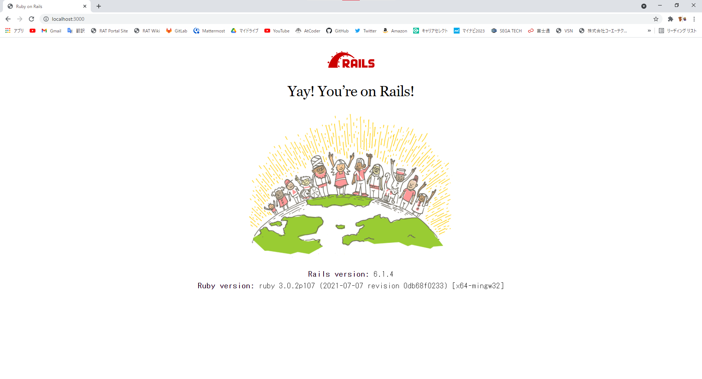

# README

今回の Open Hack U で行うことを記したりコードを載せたりします

## 記事編集方法

手順を都度更新する方法をいかに記す

### git clone する

手元に github のリポジトリと同じ環境をダウンロードしてくる

```bash
git clone https://github.com/tomru112345/OpenHACK-U.git
```

### 手元の環境を更新する

作業前に必ず行う!

ダウンロードしたリポジトリの内容が最新かどうかチェックし、更新する

```bash
git pull
```

### git add する

```bash
git add [ファイル名]
```

### git commit する

```bash
git commit -m "[変更した内容文]"
```

### git push する

push して github の内容を更新する

```bash
git push -u origin main
```

## 環境構築

以下のソフトウェアをインストールすることで基本的な rails の web サーバを起動できます

### Ruby install

* [Rubyのダウンロードとインストール](https://www.javadrive.jp/ruby/install/index1.html)

### Ruby on Rails install

* [Railsをインストールする](https://www.javadrive.jp/rails/install/index1.html)

### SQLite3 install

* [RailsからSQLite3を利用できるようにする](https://www.javadrive.jp/rails/install/index2.html)

### Node.js install

* [Node.jsをインストールする](https://qiita.com/sefoo0104/items/0653c935ea4a4db9dc2b)

### Yarn install

* [Yarn を導入しよう（Windows）](https://qiita.com/kurararara/items/21c70c4adfd3bb323412)

### webpacker install

アプリケーションを作成する

```bash
rails new [app name]
```

webpackerをインストールする

```bash
rails webpacker:install
```

### サーバを起動

web サーバを起動する

```bash
rails s
```

http://localhost:3000 にアクセス

以下のように表示される



## コントローラのアクションの追加

Application コントローラに hello を追加

* app/controllers/application_controller.rb

```rb
class ApplicationController < ActionController::Base
  protect_from_forgery with: :exception

  def hello
    render html: "hello, world!"
  end
end
```

* config/routes.rb 内の設定変更で、表示したいアクションを変更できる

```rb
Rails.application.routes.draw do
  # For details on the DSL available within this file,
  # see http://railsguides.jp/routing.html
end
```

以下のように変更してみる

```rb
Rails.application.routes.draw do
  root 'application#hello'
end
```

これで上記同様、アクセス

以下のような表示になっている


## 事前知識

### Bundler

Bundler は gem を管理するための gem

### Gemfile

gem をインストールするための「設計図」のようなもの

### gemfile.lock

gem をインストールした後の、「結果図」のようなもの

### bundle install

railsは、gemfile.lockを元にgemのインストールを行う

この時、gemfile.lockに記述されていない、且つgemfileに記述されているgemがある場合、そのgemとそのgemに関連するgemをインストール後、gemfile.lockを更新する

```bash
bundle install
```

## Oracle Cloud

```bash
bundle config build.sqlite3 "--with-sqlite3-lib=/usr/local/lib"
```

## 参考資料

* [Ruby 入門](https://www.javadrive.jp/ruby/)

* [Ruby on Rails チュートリアル全まとめ(解説・単語・演習)](https://qiita.com/bitcoinjpnnet/items/c43a87eca6313ad1903f)
