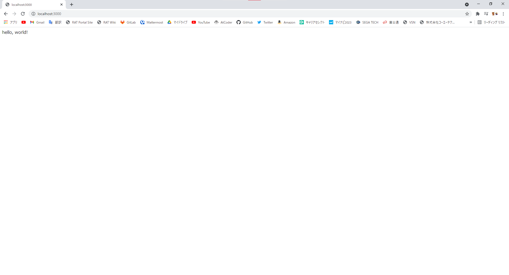

# README

今回の Open Hack U で行うことを記したりコードを載せたりします

## 記事編集方法

手順を都度更新する方法をいかに記す

### git clone する

手元に github のリポジトリと同じ環境をダウンロードしてくる

```bash
git clone https://github.com/tomru112345/OpenHACK-U.git
```

### 手元の環境を更新する

作業前に必ず行う!

ダウンロードしたリポジトリの内容が最新かどうかチェックし、更新する

```bash
git pull
```

### git add する

```bash
git add [ファイル名]
```

### git commit する

```bash
git commit -m "[変更した内容文]"
```

### git push する

push して github の内容を更新する

```bash
git push -u origin main
```

## 環境構築

以下のソフトウェアをインストールすることで基本的な rails の web サーバを起動できます

### Ruby install

* [Rubyのダウンロードとインストール](https://www.javadrive.jp/ruby/install/index1.html)

### Ruby on Rails install

* [Railsをインストールする](https://www.javadrive.jp/rails/install/index1.html)

### SQLite3 install

* [RailsからSQLite3を利用できるようにする](https://www.javadrive.jp/rails/install/index2.html)

### Node.js install

* [Node.jsをインストールする](https://qiita.com/sefoo0104/items/0653c935ea4a4db9dc2b)

### Yarn install

* [Yarn を導入しよう（Windows）](https://qiita.com/kurararara/items/21c70c4adfd3bb323412)

### webpacker install

アプリケーションを作成する

```bash
rails new [app name]
```

webpackerをインストールする

```bash
rails webpacker:install
```

### サーバを起動

web サーバを起動する

```bash
rails s
```

http://localhost:3000 にアクセス

以下のように表示される


## コントローラのアクションの追加

Application コントローラに hello を追加

* app/controllers/application_controller.rb

```rb
class ApplicationController < ActionController::Base
  protect_from_forgery with: :exception

  def hello
    render html: "hello, world!"
  end
end
```

* config/routes.rb 内の設定変更で、表示したいアクションを変更できる

```rb
Rails.application.routes.draw do
  # For details on the DSL available within this file,
  # see http://railsguides.jp/routing.html
end
```

以下のように変更してみる

```rb
Rails.application.routes.draw do
  root 'application#hello'
end
```

これで上記同様、アクセス

以下のような表示になっている



## 事前知識

### Bundler

Bundler は gem を管理するための gem

### Gemfile

gem をインストールするための「設計図」のようなもの

### gemfile.lock

gem をインストールした後の、「結果図」のようなもの

### bundle install

railsは、gemfile.lockを元にgemのインストールを行う

この時、gemfile.lockに記述されていない、且つgemfileに記述されているgemがある場合、そのgemとそのgemに関連するgemをインストール後、gemfile.lockを更新する

```bash
bundle install
```

## twitter クローン作成

### 使用 Gem のインストール

Gemfile に以下の欄を追加

| gem | 内容 |
| ---- | ---- |
| sorcery | 認証機能 |
| haml-rails | HTML 特化の文法を持つテンプレートエンジン |
| bootstrap-sass | CSS フレームワーク |

```Gemfile
gem 'sorcery'
gem 'haml-rails'
gem 'bootstrap-sass'
```

インストールする

```bash
bundle install
```

### css のフォーマットを変更

railsデフォルトのscssではなくて、より簡潔な記述が出来るsassを使う

* config/application.rb

```rb
     # The default locale is :en and all translations from config/locales/*.rb,yml are auto loaded.
     # config.i18n.load_path += Dir[Rails.root.join('my', 'locales', '*.{rb,yml}').to_s]
     # config.i18n.default_locale = :de
 
     config.sass.preferred_syntax = :sass
   end
 end
```

### 認証機能のコードを自動生成

認証機能のためのコードを自動生成させる。

* gem の sorcery の機能を使う。

```bash
rails g sorcery:install
```

### scaffold で users を作成

* sorcery:install で users テーブル作成のマイグレーションファイルを作成している

  * --skip-migration する

* scaffold で通常生成される scaffold.css というファイルが bootstrap と競合して表示がおかしくなる

  * 不要

* -s : 既存のファイル生成をスキップする

* --skip-collision-check : Skip collision check

```bash
rails g scaffold user -s --no-stylesheets --skip-migration --skip-collision-check
```

### ユーザー名、表示名、プロフィールのカラムを追加

```bash
rails g migration add_name_and_screen_name_and_bio_to_users name:string screen_name:string bio:string
```

### マイグレーションしてデータベース・テーブルを作成

```bash
rake db:migrate
```

### サインアップ用のコントローラーを生成

サインアップの機能に、registrations の名前をあてている

新規登録フォーム画面の new アクションと、それを POST メソッドで受け取るcreate アクションを想定していますが、テンプレートを持つ画面は new 飲みなので、new のみ指定する。

```bash
rails generate controller registrations new
```

### Bootstrap の読み込み

app/assets/stylesheets/application.css を application.css.sass という名前に変更する

```bash
mv ./app/assets/stylesheets/application.css{,.sass}
```

ファイル内に bootstrap を import する

* app/assets/stylesheets/application.css.sass

```sass
 *= require_tree .
 *= require_self
 */

@import bootstrap
```

### layout の変更

* app/views/layouts/application.html.erb

バックアップを取る

```bash
cp ./app/views/layouts/application.html.erb{,.default}
```

application.html.erb を変更する

```erb
<!DOCTYPE html>
<html>
  <head>
    <title>SampleApp</title>
    <meta name="viewport" content="width=device-width,initial-scale=1">
    <%= csrf_meta_tags %>
    <%= csp_meta_tag %>

    <%= stylesheet_link_tag 'application', media: 'all', 'data-turbolinks-track': 'reload' %>
    <%= javascript_pack_tag 'application', 'data-turbolinks-track': 'reload' %>
  </head>

  <body id="application">
    <div>
      <%= yield %>
    </div>
  </body>
</html>
```

変更を見る

```bash
$ diff ./app/views/layouts/application.html.erb{.default,}
13,14c13,16
<   <body>
<     <%= yield %>
---
>   <body id="application">
>     <div>
>       <%= yield %>
>     </div>
```

http://localhost:3000/registrations/new へアクセス


### サインアップ機能(新規作成画面)の実装

* config/routes.rb

バックアップを取る

```bash
cp ./config/routes.rb{,.default}
```

Routing を実装する

```bash
$ diff ./config/routes.rb{.default,}
2,3c2
<   get 'registrations/new'
<   resources :users
---
>   resource :registrations, only: [:new, :create]
```

* app/models/user.rb

バックアップを取る

```bash
cp ./app/models/user.rb{,.default}
```

Model を実装する

* バリデーションは極力早く書くように

* 開発中であってもおかしいレコードが DB に入り込まないように意識することが重要

```bash
$ diff ./app/models/user.rb{.default,}
2a3,9
>
>   validates :name, presence: true, uniqueness: { case_sensitive: false }, format: { with: /\A[a-z][a-z0-9]+\z/ }, length: { in: 4..24 }
>   validates :screen_name, length: { maximum: 140 }
>   validates :bio, length: { maximum: 200  }
>   validates :email, presence: true, uniqueness: { case_sensitive: false }
>   validates :password, confirmation: true, length: { in: 6..24 }, if: :password
>   validates :password_confirmation, presence: true, if: :password
```

* app/controllers/registrations_controller.rb

バックアップを取る

```bash
cp ./app/controllers/registrations_controller.rb{,.default}
```

Controller を実装する

```rb
class RegistrationsController < ApplicationController
  def new
    @user = User.new
  end
end
```

比較する

```bash
$ diff ./app/controllers/registrations_controller.rb{.default,}
2a3
>     @user = User.new
```

* app/views/registrations/new.html.haml

バックアップを取る

```bash
cp ./app/views/registrations/new.html.haml{,.default}
```

View を実装する

```haml
%h1 Registrations#new
%p Find me in app/views/registrations/new.html.haml

= form_for @user, url: registrations_path, method: :post do |f|
  = f.label :name
  = f.text_field :name
  = f.label :email
  = f.text_field :email
  = f.label :password
  = f.password_field :password
  = f.label :password_confirmation
  = f.password_field :password_confirmation
  = f.submit
```

比較する

```bash
$ diff ./app/views/registrations/new.html.haml{.default,}
2a3,13
>
> = form_for @user, url: registrations_path, method: :post do |f|
>   = f.label :name
>   = f.text_field :name
>   = f.label :email
>   = f.text_field :email
>   = f.label :password
>   = f.password_field :password
>   = f.label :password_confirmation
>   = f.password_field :password_confirmation
>   = f.submit
\ No newline at end of file
```


### サインアップ機能(新規登録の実行)の実装

Routing 定義

サインアップ後に、トップページを表示するようにしたいので、root toで定義する

* とりあえずここではこのページで定義しておいて、Tweet機能ができてタイムラインができてからそれに置き換える

* config/routes.rb

```rb
Rails.application.routes.draw do
  resource :registrations, only: [:new, :create]
  root to: 'registrations#new'
  # For details on the DSL available within this file, see https://guides.rubyonrails.org/routing.html
end
```

Controller 定義

* app/controllers/registrations_controller.rb

```rb
class RegistrationsController < ApplicationController
  def new
    @user = User.new
  end

  def create
    @user = User.new(params_user)

    if @user.save
      redirect_to root_url
    else
      render :new
    end
  end

  private

  def params_user
    params.require(:user).permit(:name, :email, :password, :password_confirmation)
  end
end
```

### 登録に失敗した際のエラーメッセージを表示

* app/views/registrations/new.html.haml

```haml
%h1 Registrations#new
%p Find me in app/views/registrations/new.html.haml

- @user.errors.each do |attr, message|
  .alert.alert-danger= message

= form_for @user, url: registrations_path, method: :post do |f|
  = f.label :name
  = f.text_field :name
  = f.label :email
  = f.text_field :email
  = f.label :password
  = f.password_field :password
  = f.label :password_confirmation
  = f.password_field :password_confirmation
  = f.submit
```

### デフォルトの言語を日本語に設定する

* config/application.rb

```rb
require_relative "boot"

require "rails/all"

# Require the gems listed in Gemfile, including any gems
# you've limited to :test, :development, or :production.
Bundler.require(*Rails.groups)

module SampleApp
  class Application < Rails::Application
    # Initialize configuration defaults for originally generated Rails version.
    config.load_defaults 6.1

    # Configuration for the application, engines, and railties goes here.
    #
    # These settings can be overridden in specific environments using the files
    # in config/environments, which are processed later.
    #
    # config.time_zone = "Central Time (US & Canada)"
    # config.eager_load_paths << Rails.root.join("extras")
    config.i18n.default_locale = :ja
    
    config.sass.preferred_syntax = :sass
  end
end
```

### ロケールファイル追加

各言語ごとの文章を定義しておくファイルをロケールファイルと呼ぶ

config/locales/jp.yml を作成する

```bash
vi config/locales/jp.yml
```

* config/locales/jp.yml

```yml
ja:
  activerecord:
    errors:
      models:
```

メッセージを定義する

```yml
ja:
  activerecord:
    errors:
      models:
        user:
            attributes:
              name:
                blank: ユーザー名は空ではいけません
                taken: ユーザー名は既に利用されています
                invalid: ユーザー名には半角英数字のみ利用できます
                too_long: ユーザー名は24文字まで利用できます
                too_short: ユーザー名は最短で4文字必要です
              email:
                blank: メールアドレスが空です
                taken: メールアドレスが既に使用済みです
              password:
                blank: パスワードが空です
                too_long: パスワードは24文字以内で利用できます
                too_short: パスワードは6文字以上で利用できます
              password_confirmation:
                blank: 確認用パスワードが空です
                confirmation: 確認用パスワードが一致しません
              bio:
                too_long: プロフィールは200文字以内でなければなりません
```

### 背景画像の設定

* app/views/layouts/registrations.html.haml

ファイルを生成する

```bash
code app/views/layouts/registrations.html.haml
```

以下を追加する

```haml
!!!
%html
%head
  %title Sample_app
  = stylesheet_link_tag    'application', media: 'all', 'data-turbolinks-track' => true
  = javascript_pack_tag 'application', 'data-turbolinks-track' => true
  = csrf_meta_tags
%body#registrations
  = yield
```

* app/assets/stylesheets/application.css.sass

```sass
 *= require_tree .
 *= require_self
 */
@import bootstrap

 
html, body
  width: 100%
  height: 100%
 
.clear
  clear: both
```

背景画像を app/assets/images/back.jpg に配置する

```bash
cp ../img/Hosei.png app/assets/images/back.jpg
```

```bash
code app/assets/stylesheets/registrations.css.sass
```

* app/assets/stylesheets/registrations.css.sass

```sass
// Place all the styles related to the registrations controller here.
// They will automatically be included in application.css.
// You can use Sass (SCSS) here: http://sass-lang.com/
 
#registrations
  background-image: asset-url("back.jpg")
  background-position: center
  background-size: cover
  background-color: transparent
  background-repeat: no-repeat
  background-color: #050911
  #registrations-new
    width: 100%
    height: 100%
    .left-content
      margin-top: 45px
      padding: 0px 45px
      color: #fff
      h1
        font-size: 50px
        margin: 0px
        margin-top: 10px
      .ex
        font-size: 18px
        margin: 45px 0px
    .right-content
      padding: 0px 45px
      form
        margin: 45px 0px
        padding: 30px 35px
        border: 1px solid #fff
        border-radius: 6px
        background-color: rgba(0, 0, 0, 0.3)
        color: #fff
        h2
          margin: 0px 0px 20px 0px
          border-bottom: 1px solid rgba(255, 255, 255, 0.5)
          padding-bottom: 10px
          font-size: 20px
        .control-label
          font-weight: 400
        .btn
          width: 100%
          padding: 12px
          margin-top: 10px
          margin-bottom: 10px
          font-size: 16px
```

* app/views/registrations/new.html.haml

```haml
#registrations-new
  .col-xs-6.left-content
    %h1 #Sample_app
    %p.ex
      このサイトは、シラバスのRails学習コースの完成形サンプルアプリです。
    %p.by
      開発者: @null_point デザイン: @null_point 企画: @null_point
  .col-xs-6.right-content
    = form_for @user, url: registrations_path, method: :post do |f|
      %h2
        会員登録する
      - @user.errors.each do |attr, message|
        .alert.alert-danger= message
      .form-group
        = f.label :name, "ユーザーID: @@null_point_jp", class: "control-label"
        = f.text_field :name, class: "form-control"
      .form-group
        = f.label :email,"メールアドレス: hello@@null_point.jp", class: "control-label"
        = f.text_field :email, class: "form-control"
      .form-group
        = f.label :password, "パスワード: 6文字以上", class: "control-label"
        = f.password_field :password, class: "form-control"
      .form-group
        = f.label :password_confirmation, "確認用パスワード: 6文字以上", class: "control-label"
        = f.password_field :password_confirmation, class: "form-control"
      = f.submit "登録する", class: "btn btn-primary"
      .clear
```


## 参考資料

* [Ruby 入門](https://www.javadrive.jp/ruby/)

* [Ruby on Rails チュートリアル全まとめ(解説・単語・演習)](https://qiita.com/bitcoinjpnnet/items/c43a87eca6313ad1903f)
