# 手順書

## 目次

- [twitter クローン作成](#twitter-クローン作成)
  - [使用 Gem のインストール](#使用-gem-のインストール)
  - [css のフォーマットを変更](#css-のフォーマットを変更)
  - [認証機能のコードを自動生成](#認証機能のコードを自動生成)
  - [scaffold で users を作成](#scaffold-で-users-を作成)
  - [ユーザー名、表示名、プロフィールのカラムを追加](#ユーザー名表示名プロフィールのカラムを追加)
  - [マイグレーションしてデータベース・テーブルを作成](#マイグレーションしてデータベーステーブルを作成)
  - [サインアップ用のコントローラーを生成](#サインアップ用のコントローラーを生成)
  - [Bootstrap の読み込み](#bootstrap-の読み込み)
  - [layout の変更](#layout-の変更)
  - [サインアップ機能(新規作成画面)の実装](#サインアップ機能新規作成画面の実装)
  - [サインアップ機能(新規登録の実行)の実装](#サインアップ機能新規登録の実行の実装)
  - [登録に失敗した際のエラーメッセージを表示](#登録に失敗した際のエラーメッセージを表示)
  - [デフォルトの言語を日本語に設定する](#デフォルトの言語を日本語に設定する)
  - [ロケールファイル追加](#ロケールファイル追加)
  - [背景画像の設定](#背景画像の設定)
  - [サインイン機能(ログイン画面)の実装](#サインイン機能ログイン画面の実装)
  - [ログイン画面へのリンク作成](#ログイン画面へのリンク作成)
  - [ログイン機能(ログイン処理)の実装](#ログイン機能ログイン処理の実装)
  - [ログイン失敗時のエラーメッセージ表示](#ログイン失敗時のエラーメッセージ表示)
  - [ユーザー一覧とプロフィール](#ユーザー一覧とプロフィール)
  - [Users#index の Template(View) を書く](#usersindex-の-templateview-を書く)
  - [Users#showのTemplate(View)を書く](#usersshowのtemplateviewを書く)
  - [Users#indexを調整する](#usersindexを調整する)
  - [Users#showを調整する](#usersshowを調整する)
  - [ヘッダーのPartial(View)の書く](#ヘッダーのpartialviewの書く)
  - [プロフィール設定](#プロフィール設定)
  - [helper を使う](#helper-を使う)
  - [Settings#edit を調整する](#settingsedit-を調整する)
  - [Settings#editのスタイル設定](#settingseditのスタイル設定)
  - [validation の設定](#validation-の設定)
  - [ログアウト機能](#ログアウト機能)
  - [Users#index, showをログインしていないと入れないようにする](#usersindex-showをログインしていないと入れないようにする)
  - [noticeの表示](#noticeの表示)
  - [Sessions#new の notice](#sessionsnew-の-notice)
  - [tweet 機能のコード生成](#tweet-機能のコード生成)
  - [tweets テーブルにインデックスをはる](#tweets-テーブルにインデックスをはる)
  - [ヘッダーに tweets#index へのリンクを置く](#ヘッダーに-tweetsindex-へのリンクを置く)
  - [サインアップ後にログインするようにする](#サインアップ後にログインするようにする)
  - [Route 定義の順序の変更](#route-定義の順序の変更)
  - [Controller 変更](#controller-変更)
  - [ログインしていないと見れないようにする](#ログインしていないと見れないようにする)
  - [TweetモデルとUserモデルの関連付け(one to many関連)](#tweetモデルとuserモデルの関連付けone-to-many関連)
  - [Tweet の Validation 定義](#tweet-の-validation-定義)
  - [View(テンプレート)実装](#viewテンプレート実装)
  - [つぶやきの作成時間を修整する](#つぶやきの作成時間を修整する)
  - [ツイート一覧画面から、ツイートを投稿できるようにする](#ツイート一覧画面からツイートを投稿できるようにする)
  - [投稿後は、ツイート一覧画面にリダイレクトする](#投稿後はツイート一覧画面にリダイレクトする)
  - [ツイート投稿失敗した場合のメッセージ表示](#ツイート投稿失敗した場合のメッセージ表示)
  - [Tweetを新しい順で並べ替える](#tweetを新しい順で並べ替える)
  - [Users#showの内容を調整](#usersshowの内容を調整)
  - [ログインしている場合はタイムラインを表示する](#ログインしている場合はタイムラインを表示する)
  - [会員登録後タイムラインを表示](#会員登録後タイムラインを表示)
  - [ログイン後タイムラインを表示](#ログイン後タイムラインを表示)
  - [お気に入り機能](#お気に入り機能)
    - [favorite-many-to-many連携のための中間テーブル生成](#favorite-many-to-many連携のための中間テーブル生成)
    - [favorite-インデックスの追加と高速化](#favorite-インデックスの追加と高速化)
    - [favorite-マイグレーションを実行](#favorite-マイグレーションを実行)
    - [favorite-ルーティングの定義](#favorite-ルーティングの定義)
    - [favorite-コントローラーの作成](#favorite-コントローラーの作成)
    - [favorite-モデルの記述](#favorite-モデルの記述)
    - [favorite-Viewを調整](#favorite-Viewを調整)
  - [フォロー機能](#フォロー機能)
    - [follow-many-to-many連携のための中間テーブル生成](#follow-many-to-many連携のための中間テーブル生成)
    - [follow-インデックスを追加して高速化](#follow-インデックスを追加して高速化)
    - [follow-マイグレーションを実行](#follow-マイグレーションを実行)
    - [follow-ルーティングを定義](#follow-ルーティングを定義)
    - [follow-コントローラーの作成](#follow-コントローラーの作成)
    - [follow-モデルを記述](#follow-モデルを記述)
    - [follow-Viewを調整](#follow-Viewを調整)
    - [follow-お気に入りorフォローしたとき、リファラを使って同じ画面を表示する](#follow-お気に入りorフォローしたとき、リファラを使って同じ画面を表示する)
  - [全てのつぶやき-フォローしている人のつぶやきボタンの変化](#全てのつぶやき-フォローしている人のつぶやきボタンの変化)
  - [favoriteボタンの変更](#favoriteボタンの変更)
  - [アカウント作成から自動ログインでバグるのを修正](#アカウント作成から自動ログインでバグるのを修正)
  - [googleAPIを利用して、ネガポジ度数を取得](#googleAPIを利用して、ネガポジ度数を取得)
  - [ネガポジ度から、ツイート自身の背景色を変更する](#ネガポジ度から、ツイート自身の背景色を変更する)

## twitter クローン作成

### 使用 Gem のインストール

Gemfile に以下の欄を追加

| gem | 内容 |
| ---- | ---- |
| sorcery | 認証機能 |
| haml-rails | HTML 特化の文法を持つテンプレートエンジン |
| bootstrap-sass | CSS フレームワーク |

```Gemfile
gem 'sorcery'
gem 'haml-rails'
gem 'bootstrap-sass'
gem 'record_tag_helper'
```

インストールする

```bash
bundle install
```

### css のフォーマットを変更

railsデフォルトのscssではなくて、より簡潔な記述が出来るsassを使う

* config/application.rb

```rb
     # The default locale is :en and all translations from config/locales/*.rb,yml are auto loaded.
     # config.i18n.load_path += Dir[Rails.root.join('my', 'locales', '*.{rb,yml}').to_s]
     # config.i18n.default_locale = :de
 
     config.sass.preferred_syntax = :sass
   end
 end
```

### 認証機能のコードを自動生成

認証機能のためのコードを自動生成させる。

* gem の sorcery の機能を使う。

```bash
rails g sorcery:install
```

### scaffold で users を作成

* sorcery:install で users テーブル作成のマイグレーションファイルを作成している

  * --skip-migration する

* scaffold で通常生成される scaffold.css というファイルが bootstrap と競合して表示がおかしくなる

  * 不要

* -s : 既存のファイル生成をスキップする

* --skip-collision-check : Skip collision check

```bash
rails g scaffold user -s --no-stylesheets --skip-migration --skip-collision-check
```

### ユーザー名、表示名、プロフィールのカラムを追加

```bash
rails g migration add_name_and_screen_name_and_bio_to_users name:string screen_name:string bio:string
```

### マイグレーションしてデータベース・テーブルを作成

```bash
rake db:migrate
```

### サインアップ用のコントローラーを生成

サインアップの機能に、registrations の名前をあてている

新規登録フォーム画面の new アクションと、それを POST メソッドで受け取るcreate アクションを想定していますが、テンプレートを持つ画面は new 飲みなので、new のみ指定する。

```bash
rails generate controller registrations new
```

### Bootstrap の読み込み

app/assets/stylesheets/application.css を application.css.sass という名前に変更する

```bash
mv ./app/assets/stylesheets/application.css{,.sass}
```

ファイル内に bootstrap を import する

* app/assets/stylesheets/application.css.sass

```sass
 *= require_tree .
 *= require_self
 */

@import bootstrap
```

### layout の変更

* app/views/layouts/application.html.erb

バックアップを取る

```bash
cp ./app/views/layouts/application.html.erb{,.default}
```

application.html.erb を変更する

```erb
<!DOCTYPE html>
<html>
  <head>
    <title>SampleApp</title>
    <meta name="viewport" content="width=device-width,initial-scale=1">
    <%= csrf_meta_tags %>
    <%= csp_meta_tag %>

    <%= stylesheet_link_tag 'application', media: 'all', 'data-turbolinks-track': 'reload' %>
    <%= javascript_pack_tag 'application', 'data-turbolinks-track': 'reload' %>
  </head>

  <body id="application">
    <div>
      <%= yield %>
    </div>
  </body>
</html>
```

変更を見る

```bash
$ diff ./app/views/layouts/application.html.erb{.default,}
13,14c13,16
<   <body>
<     <%= yield %>
---
>   <body id="application">
>     <div>
>       <%= yield %>
>     </div>
```

http://localhost:3000/registrations/new へアクセス

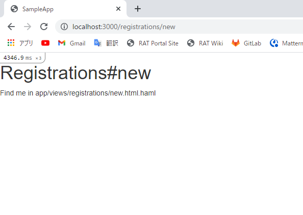

### サインアップ機能(新規作成画面)の実装

* config/routes.rb

バックアップを取る

```bash
cp ./config/routes.rb{,.default}
```

Routing を実装する

```bash
$ diff ./config/routes.rb{.default,}
2,3c2
<   get 'registrations/new'
<   resources :users
---
>   resource :registrations, only: [:new, :create]
```

* app/models/user.rb

バックアップを取る

```bash
cp ./app/models/user.rb{,.default}
```

Model を実装する

* [バリデーション](https://qiita.com/Qiita/items/c686397e4a0f4f11683d)は極力早く書くように

* 開発中であってもおかしいレコードが DB に入り込まないように意識することが重要

```bash
$ diff ./app/models/user.rb{.default,}
2a3,9
>
>   validates :name, presence: true, uniqueness: { case_sensitive: false }, format: { with: /\A[a-z][a-z0-9]+\z/ }, length: { in: 4..24 }
>   validates :screen_name, length: { maximum: 140 }
>   validates :bio, length: { maximum: 200  }
>   validates :email, presence: true, uniqueness: { case_sensitive: false }
>   validates :password, confirmation: true, length: { in: 6..24 }, if: :password
>   validates :password_confirmation, presence: true, if: :password
```

* app/controllers/registrations_controller.rb

バックアップを取る

```bash
cp ./app/controllers/registrations_controller.rb{,.default}
```

Controller を実装する

```rb
class RegistrationsController < ApplicationController
  def new
    @user = User.new
  end
end
```

比較する

```bash
$ diff ./app/controllers/registrations_controller.rb{.default,}
2a3
>     @user = User.new
```

* app/views/registrations/new.html.haml

バックアップを取る

```bash
cp ./app/views/registrations/new.html.haml{,.default}
```

View を実装する

```haml
%h1 Registrations#new
%p Find me in app/views/registrations/new.html.haml

= form_for @user, url: registrations_path, method: :post do |f|
  = f.label :name
  = f.text_field :name
  = f.label :email
  = f.text_field :email
  = f.label :password
  = f.password_field :password
  = f.label :password_confirmation
  = f.password_field :password_confirmation
  = f.submit
```

比較する

```bash
$ diff ./app/views/registrations/new.html.haml{.default,}
2a3,13
>
> = form_for @user, url: registrations_path, method: :post do |f|
>   = f.label :name
>   = f.text_field :name
>   = f.label :email
>   = f.text_field :email
>   = f.label :password
>   = f.password_field :password
>   = f.label :password_confirmation
>   = f.password_field :password_confirmation
>   = f.submit
\ No newline at end of file
```

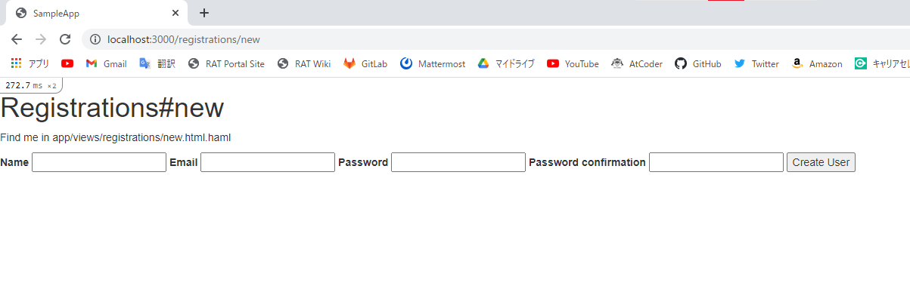

### サインアップ機能(新規登録の実行)の実装

Routing 定義

サインアップ後に、トップページを表示するようにしたいので、root toで定義する

* とりあえずここではこのページで定義しておいて、Tweet機能ができてタイムラインができてからそれに置き換える

* config/routes.rb

```rb
Rails.application.routes.draw do
  resource :registrations, only: [:new, :create]
  root to: 'registrations#new'
  # For details on the DSL available within this file, see https://guides.rubyonrails.org/routing.html
end
```

Controller 定義

* app/controllers/registrations_controller.rb

```rb
class RegistrationsController < ApplicationController
  def new
    @user = User.new
  end

  def create
    @user = User.new(params_user)

    if @user.save
      redirect_to root_url
    else
      render :new
    end
  end

  private

  def params_user
    params.require(:user).permit(:name, :email, :password, :password_confirmation)
  end
end
```

### 登録に失敗した際のエラーメッセージを表示

* app/views/registrations/new.html.haml

```haml
%h1 Registrations#new
%p Find me in app/views/registrations/new.html.haml

- @user.errors.each do |attr, message|
  .alert.alert-danger= message

= form_for @user, url: registrations_path, method: :post do |f|
  = f.label :name
  = f.text_field :name
  = f.label :email
  = f.text_field :email
  = f.label :password
  = f.password_field :password
  = f.label :password_confirmation
  = f.password_field :password_confirmation
  = f.submit
```

### デフォルトの言語を日本語に設定する

* config/application.rb

```rb
require_relative "boot"

require "rails/all"

# Require the gems listed in Gemfile, including any gems
# you've limited to :test, :development, or :production.
Bundler.require(*Rails.groups)

module SampleApp
  class Application < Rails::Application
    # Initialize configuration defaults for originally generated Rails version.
    config.load_defaults 6.1

    # Configuration for the application, engines, and railties goes here.
    #
    # These settings can be overridden in specific environments using the files
    # in config/environments, which are processed later.
    #
    # config.time_zone = "Central Time (US & Canada)"
    # config.eager_load_paths << Rails.root.join("extras")
    config.i18n.default_locale = :ja
    
    config.sass.preferred_syntax = :sass
  end
end
```

### ロケールファイル追加

各言語ごとの文章を定義しておくファイルをロケールファイルと呼ぶ

config/locales/jp.yml を作成する

```bash
vi config/locales/jp.yml
```

* config/locales/jp.yml

```yml
ja:
  activerecord:
    errors:
      models:
```

メッセージを定義する

```yml
ja:
  activerecord:
    errors:
      models:
        user:
            attributes:
              name:
                blank: ユーザー名は空ではいけません
                taken: ユーザー名は既に利用されています
                invalid: ユーザー名には半角英数字のみ利用できます
                too_long: ユーザー名は24文字まで利用できます
                too_short: ユーザー名は最短で4文字必要です
              email:
                blank: メールアドレスが空です
                taken: メールアドレスが既に使用済みです
              password:
                blank: パスワードが空です
                too_long: パスワードは24文字以内で利用できます
                too_short: パスワードは6文字以上で利用できます
              password_confirmation:
                blank: 確認用パスワードが空です
                confirmation: 確認用パスワードが一致しません
              bio:
                too_long: プロフィールは200文字以内でなければなりません
```

### 背景画像の設定

* app/views/layouts/registrations.html.haml

ファイルを生成する

```bash
code app/views/layouts/registrations.html.haml
```

以下を追加する

```haml
!!!
%html
%head
  %title Sample_app
  = stylesheet_link_tag    'application', media: 'all', 'data-turbolinks-track' => true
  = javascript_pack_tag 'application', 'data-turbolinks-track' => true
  = csrf_meta_tags
%body#registrations
  = yield
```

* app/assets/stylesheets/application.css.sass

```sass
 *= require_tree .
 *= require_self
 */
@import bootstrap

 
html, body
  width: 100%
  height: 100%
 
.clear
  clear: both
```

背景画像を app/assets/images/back.jpg に配置する

```bash
cp ../img/Hosei.png app/assets/images/back.jpg
```

```bash
code app/assets/stylesheets/registrations.css.sass
```

* app/assets/stylesheets/registrations.css.sass

```sass
// Place all the styles related to the registrations controller here.
// They will automatically be included in application.css.
// You can use Sass (SCSS) here: http://sass-lang.com/
 
#registrations
  background-image: asset-url("back.jpg")
  background-position: center
  background-size: cover
  background-color: transparent
  background-repeat: no-repeat
  background-color: #050911
  #registrations-new
    width: 100%
    height: 100%
    .left-content
      margin-top: 45px
      padding: 0px 45px
      color: #fff
      h1
        font-size: 50px
        margin: 0px
        margin-top: 10px
      .ex
        font-size: 18px
        margin: 45px 0px
    .right-content
      padding: 0px 45px
      form
        margin: 45px 0px
        padding: 30px 35px
        border: 1px solid #fff
        border-radius: 6px
        background-color: rgba(0, 0, 0, 0.3)
        color: #fff
        h2
          margin: 0px 0px 20px 0px
          border-bottom: 1px solid rgba(255, 255, 255, 0.5)
          padding-bottom: 10px
          font-size: 20px
        .control-label
          font-weight: 400
        .btn
          width: 100%
          padding: 12px
          margin-top: 10px
          margin-bottom: 10px
          font-size: 16px
```

* app/views/registrations/new.html.haml

```haml
#registrations-new
  .col-xs-6.left-content
    %h1 #Sample_app
    %p.ex
      このサイトは、シラバスのRails学習コースの完成形サンプルアプリです。
    %p.by
      開発者: @null_point デザイン: @null_point 企画: @null_point
  .col-xs-6.right-content
    = form_for @user, url: registrations_path, method: :post do |f|
      %h2
        会員登録する
      - @user.errors.each do |attr, message|
        .alert.alert-danger= message
      .form-group
        = f.label :name, "ユーザーID: @@null_point_jp", class: "control-label"
        = f.text_field :name, class: "form-control"
      .form-group
        = f.label :email,"メールアドレス: hello@@null_point.jp", class: "control-label"
        = f.text_field :email, class: "form-control"
      .form-group
        = f.label :password, "パスワード: 6文字以上", class: "control-label"
        = f.password_field :password, class: "form-control"
      .form-group
        = f.label :password_confirmation, "確認用パスワード: 6文字以上", class: "control-label"
        = f.password_field :password_confirmation, class: "form-control"
      = f.submit "登録する", class: "btn btn-primary"
      .clear
```

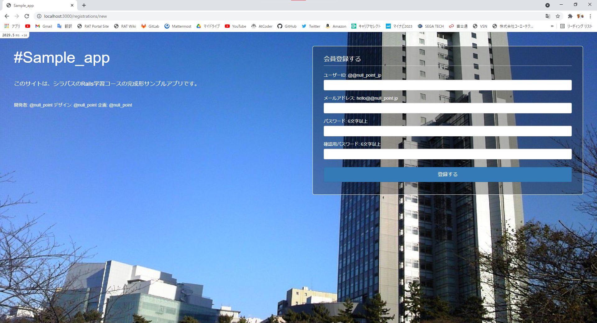

### サインイン機能(ログイン画面)の実装

ログイン画面を new, その送信先のアクションを create, ログアウトを destroy という名前で実装する

コントローラー名は sessions という名前にする

```bash
rails g controller sessions new
```

Route 定義

```rb
Rails.application.routes.draw do
  resource :registrations, only: [:new, :create]
  resource :sessions, only: [:new, :create, :destroy]
  
  root to: 'registrations#new'
  # For details on the DSL available within this file, see https://guides.rubyonrails.org/routing.html
end
```

### ログイン画面へのリンク作成

* app/assets/stylesheets/registrations.css.sass

```sass
          margin-top: 10px
          margin-bottom: 10px
          font-size: 16px
        .login
          color: #fff
          text-decoration: underline
```

* app/views/registrations/new.html.haml

```haml
        = f.label :password, "パスワード: 6文字以上", class: "control-label"
        = f.password_field :password, class: "form-control"
      .form-group
        = f.label :password_confirmation, "確認用パスワード: 6文字以上", class: "control-label"
        = f.password_field :password_confirmation, class: "form-control"
      = f.submit "登録する", class: "btn btn-primary"
      = link_to "ログインする", new_sessions_path, class: "login pull-right"
      .clear
```

Controller (アクション)定義

* app/controllers/sessions_controller.rb

```rb
class SessionsController < ApplicationController
  def new
    @user = User.new
  end
end
```

View (テンプレート)実装

* app/views/sessions/new.html.haml

```haml
%h1 Sessions#new
%p Find me in app/views/sessions/new.html.haml

= form_for @user, url: sessions_path, method: :post do |f|
  = f.label :email
  = f.text_field :email
  = f.label :password
  = f.password_field :password
  = f.submit
```

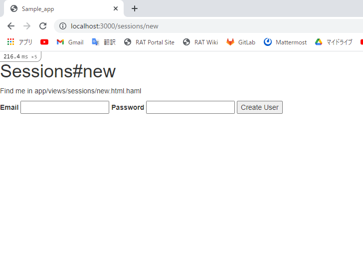

### ログイン機能(ログイン処理)の実装

* app/controllers/sessions_controller.rb

```rb
class SessionsController < ApplicationController
  def new
    @user = User.new
  end

  def create
    email    = params_user[:email]
    password = params_user[:password]

    if login(email, password)
      redirect_to root_url, notice: "successfully logged in."
    else
      @user = User.new(email: email)
      render :new
    end
  end

  private

  def params_user
    params.require(:user).permit(:email, :password)
  end
end
```

### ログイン失敗時のエラーメッセージ表示

* app/views/sessions/new.html.haml

```haml
%h1 Sessions#new
%p Find me in app/views/sessions/new.html.haml

- if action_name == "create"
  .alert.alert-danger
    メールアドレスまたはパスワードが正しくありません。

= form_for @user, url: sessions_path, method: :post do |f|
  = f.label :email
  = f.text_field :email
  = f.label :password
  = f.password_field :password
  = f.submit
```

View (レイアウト)定義

* app/views/layouts/sessions.html.haml

```haml
!!!
%html
%head
  %title Sample_appSession
  = stylesheet_link_tag    'application', media: 'all', 'data-turbolinks-track' => true
  = javascript_include_tag 'application', 'data-turbolinks-track' => true
  = csrf_meta_tags
%body#sessions
  = yield
```

* app/assets/stylesheets/sessions.css.sass

```sass
// Place all the styles related to the sessions controller here.
// They will automatically be included in application.css.
// You can use Sass here: https://sass-lang.com/

#sessions
  display: table
  widows: 100%
  height: 100%
  background-color: #f5f5f5
  #sessions-new
    display: table-cell
    vertical-align: middle
    .login-content
      margin: 0 auto
      float: none
      form
        border: 1px solid #ddd
        border-bottom-width: 3px
        border-radius: 6px
        background-color: #fff
        h2
          margin: 0px
          padding: 12px
          text-align: center
          border-bottom: 2px solid #ddd
          font-size: 18px
          font-weight: 600
        .form-body
          padding: 25px 30px
          .control-label
            font-weight: 400
          .btn
            width: 100%
            margin: 10px 0px
          .signup
            text-decoration: underline
```

* app/views/sessions/new.html.haml

```haml
#sessions-new
  .col-xs-5.login-content
    - if action_name == "create"
      .alert.alert-danger
        メールアドレスまたはパスワードが正しくありません。
    = form_for @user, url: sessions_path, method: :post do |f|
      %h2
        ログイン
      .form-body
        .form-group
          = f.label :email,"メールアドレス：hello@null_point.jp", class: "control-label"
          = f.text_field :email, class: "form-control"
        .form-group
          = f.label :password, "パスワード：6文字以上", class: "control-label"
          = f.password_field :password, class: "form-control"
        = f.submit "ログイン", class: "btn btn-success"
        = link_to root_path, class: "pull-right signup" do
          会員登録する
        .clear
```

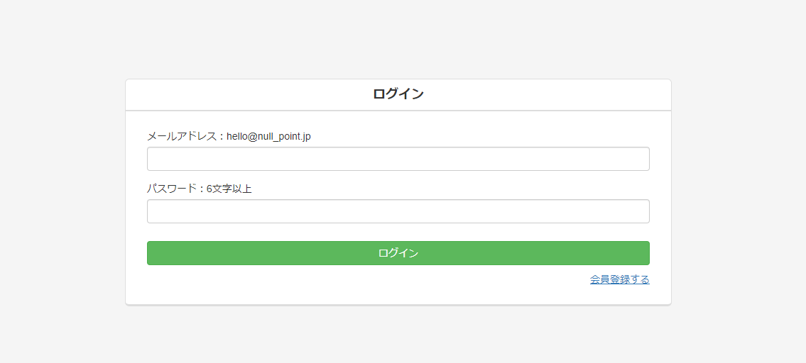

### ユーザー一覧とプロフィール

scaffold コマンドなので Model, View, Controller をそれぞれ自動で生成する

* サインアップ・サインイン機能を作るときにユーザーを表す Model はすでに作成されており、勝手に上書きされては困る

```bash
rails g scaffold user -s --no-stylesheets --skip-migration --skip-collision-check
```

Routing 定義

* config/routes.rb

```rb
resource :registrations, only: [:new, :create]
resource :sessions, only: [:new, :create, :destroy]
resources :users, only: [:index, :show]
```

Controller (アクション)定義

* app/controllers/users_controller.rb

```rb
class UsersController < ApplicationController
  #before_action :set_user, only: %i[ show edit update destroy ]

  # GET /users or /users.json
  def index
    @users = User.all
  end

  # GET /users/1 or /users/1.json
  def show
    @user = User.find(params[:id])
  end

  # GET /users/new
  def new
    @user = User.new
  end

  # GET /users/1/edit
  def edit
  end

  # POST /users or /users.json
  def create
    @user = User.new(user_params)

    respond_to do |format|
      if @user.save
        format.html { redirect_to @user, notice: "User was successfully created." }
        format.json { render :show, status: :created, location: @user }
      else
        format.html { render :new, status: :unprocessable_entity }
        format.json { render json: @user.errors, status: :unprocessable_entity }
      end
    end
  end

  # PATCH/PUT /users/1 or /users/1.json
  def update
    respond_to do |format|
      if @user.update(user_params)
        format.html { redirect_to @user, notice: "User was successfully updated." }
        format.json { render :show, status: :ok, location: @user }
      else
        format.html { render :edit, status: :unprocessable_entity }
        format.json { render json: @user.errors, status: :unprocessable_entity }
      end
    end
  end

  # DELETE /users/1 or /users/1.json
  def destroy
    @user.destroy
    respond_to do |format|
      format.html { redirect_to users_url, notice: "User was successfully destroyed." }
      format.json { head :no_content }
    end
  end

  private
    # Use callbacks to share common setup or constraints between actions.
    def set_user
      @user = User.find(params[:id])
    end

    # Only allow a list of trusted parameters through.
    def user_params
      params.fetch(:user, {})
    end
end
```

### Users#index の Template(View) を書く

* app/views/users/index.html.haml

```haml
%h1 Listing users

%table
  %tr
    %th

  - @users.each do |user|
    %tr
      %td= link_to user.name, user
```

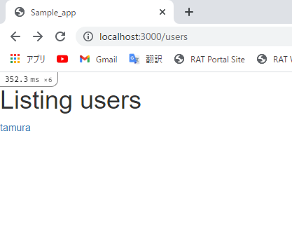

### Users#showのTemplate(View)を書く

* app/views/users/show.html.haml

```haml
%p#notice= notice

= link_to 'Back', users_path
```

### Users#indexを調整する

* app/assets/stylesheets/application.css.sass

```sass
@import bootstrap

 
html, body
  width: 100%
  height: 100%
 
.clear
  clear: both

#users-content
  float: none
  margin: 0 auto 35px
  padding: 0px
  background-color: #fff
  border: 1px solid #ddd
  border-radius: 6px
  border-bottom-width: 3px
  .list-group
    margin-bottom: -1px
    .list-group-item
      border: none
      border-bottom: 1px solid #ddd
      margin-bottom: 0px
      &:last-child
      .user
        .user-name
          a
            color: #555
        .user-id
          font-size: 14px
          color: #aaa
          font-weight: 400
        .time
          font-size: 12px
          color: #aaa
          font-weight: 400
    .user-list
      border-bottom-width: 2px
      h2
        font-size: 20px
        margin: 0px
```

* app/views/users/index.html.haml

```haml
.col-xs-8#users-content
  .list-group
    .list-group-item.user-list
      %h2 ユーザー一覧
    = div_for @users, class: "list-group-item" do |u|
      %h4.user
        %span.user-name
          = link_to u.name, user_path(u)
        %span.user-id
          @#{u.name}
      .bio
        = u.bio
```

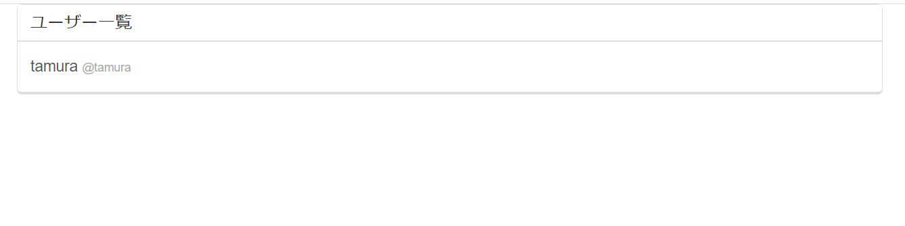

### Users#showを調整する

* app/views/users/show.html.haml

```haml
.col-xs-8#users-content
  .user-info
    %span.user-name
      = @user.name
    %span.user-id
      @#{@user.name}
    .bio
      = @user.bio
```

* app/assets/stylesheets/application.css.sass

```sass
@import bootstrap

html, body
  width: 100%
  height: 100%

#application
  background-color: #f5f5f5

.clear
  clear: both

#users-content
  float: none
  margin: 0 auto 35px
  padding: 0px
  background-color: #fff
  border: 1px solid #ddd
  border-radius: 6px
  border-bottom-width: 3px
  .list-group
    margin-bottom: -1px
    .list-group-item
      border: none
      border-bottom: 1px solid #ddd
      margin-bottom: 0px
      &:last-child
      .user
        .user-name
          a
            color: #555
        .user-id
          font-size: 14px
          color: #aaa
          font-weight: 400
        .time
          font-size: 12px
          color: #aaa
          font-weight: 400
    .user-list
      border-bottom-width: 2px
      h2
        font-size: 20px
        margin: 0px
  .user-info
    padding: 20px 35px
    .user-name
      font-size: 28px
      font-weight: 600
    .user-id
      font-size: 18px
      color: #aaa
    .bio
      margin-top: 5px
  .nav.nav-tabs
    border-top: 1px solid #ddd
    border-bottom: 2px solid #ddd
    li
      a
        border: none
        &:hover
          background-color: #fff
        .text
        .num
          font-size: 28px
```

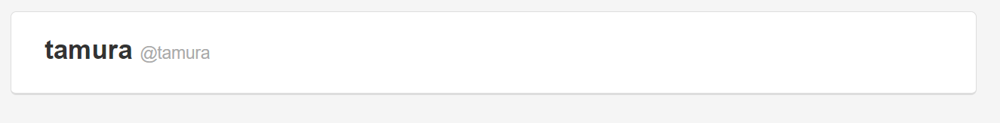

### ヘッダーのPartial(View)の書く

* app/views/layouts/_header.html.haml

```haml
.navbar.navbar-default
  .container
    .navbar-header
      = link_to '#Sample_app', root_url, class: "navbar-brand"
    - if logged_in?
      %ul.nav.navbar-nav
        %li= link_to "ユーザー一覧", users_path
      %ul.nav.navbar-nav.navbar-right
        %li= link_to current_user.name, current_user
        %li= link_to "ログアウト", sessions_path, method: :delete
    - else
      %ul.nav.navbar-nav.navbar-right
        %li= link_to "会員登録", new_registrations_path
        %li= link_to "ログイン", new_sessions_path
```

* app/views/layouts/application.html.erb

```erb
<!DOCTYPE html>
<html>
  <head>
    <title>Sample_app</title>
    <meta name="viewport" content="width=device-width,initial-scale=1">
    <%= csrf_meta_tags %>
    <%= csp_meta_tag %>

    <%= stylesheet_link_tag 'application', media: 'all', 'data-turbolinks-track': 'reload' %>
    <%= javascript_pack_tag 'application', 'data-turbolinks-track': 'reload' %>
  </head>

  <body id="application">
    <div>
      <%= render partial: "layouts/header" %>
      <%= yield %>
    </div>
  </body>
</html>
```

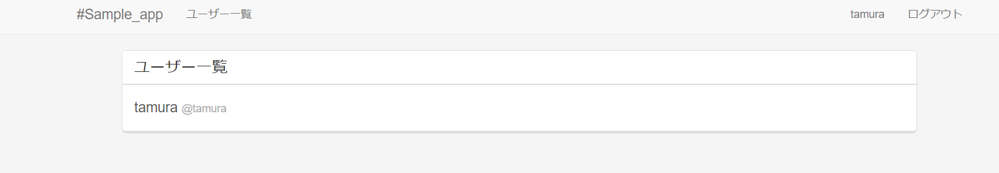

### プロフィール設定

```bash
rails g controller settings edit
```

Routing を定義する

* config/routes.rb

```rb
Rails.application.routes.draw do
  resource :registrations, only: [:new, :create]
  resource :sessions, only: [:new, :create, :destroy]
  resource :settings, only: [:edit, :update]
  resources :users, only: [:index, :show]
  
  root to: 'registrations#new'
  # For details on the DSL available within this file, see https://guides.rubyonrails.org/routing.html
end
```

Controller を定義する

* app/controllers/settings_controller.rb

```rb
class SettingsController < ApplicationController
  def edit
    @user = current_user
  end

   
  def update
    @user = current_user
    @user.update_attributes(params_user)
    redirect_to user_url(@user)
  end

  private

  def params_user
    params.require(:user).permit(:name, :screen_name, :bio)
  end
end
```

* View を定義する

```haml
%h1 Settings#edit
%p Find me in app/views/settings/edit.html.haml

= form_for @user, url: settings_path, method: :put do |f|
  = f.label :name
  = f.text_field :name
  = f.label :screen_name
  = f.text_field :screen_name
  = f.label :bio
  = f.text_area :bio
  = f.submit
```

* app/views/layouts/_header.html.haml

```haml
.navbar.navbar-default
  .container
    .navbar-header
      = link_to '#Sample_app', root_url, class: "navbar-brand"
    - if logged_in?
      %ul.nav.navbar-nav
        %li= link_to "ユーザー一覧", users_path
      %ul.nav.navbar-nav.navbar-right
        %li= link_to current_user.name, current_user
        %li= link_to "設定", edit_settings_path
        %li= link_to "ログアウト", sessions_path, method: :delete
    - else
      %ul.nav.navbar-nav.navbar-right
        %li= link_to "会員登録", new_registrations_path
        %li= link_to "ログイン", new_sessions_path
```

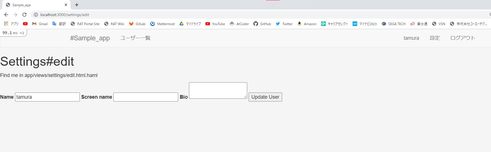

### helper を使う

```rb
module UsersHelper
    def render_user_screen_name user
        if user.screen_name.blank?
            user.name
        else
            user.screen_name
        end
    end
end
```

* app/views/users/index.html.haml

```haml
.col-xs-8#users-content
  .list-group
    .list-group-item.user-list
      %h2 ユーザー一覧
    = div_for @users, class: "list-group-item" do |u|
      %h4.user
        %span.user-name
          = link_to u.name, user_path(u)
          = link_to render_user_screen_name(u), user_path(u)
        %span.user-id
          @#{u.name}
      .bio
        = u.bio
```

* app/views/users/show.html.haml

```haml
.col-xs-8#users-content
  .user-info
    %span.user-name
      = @user.name
      = render_user_screen_name(@user)
    %span.user-id
      @#{@user.name}
    .bio
      = @user.bio
```

### Settings#edit を調整する

* app/views/settings/edit.html.haml

```haml
#settings-edit
  .col-xs-6.settings-content
    = form_for @user, url: settings_path, method: :put do |f|
      %h2
        設定
      .form-body
        .form-group
          = f.label :name, "ユーザーID: @null_point_jp", class: "control-label"
          = f.text_field :name, class: "form-control"
        .form-group
          = f.label :screen_name, "表示名: ヌルポ", class: "control-label"
          = f.text_field :screen_name, class: "form-control"
        .form-group
          = f.label :bio, "プロフィール(200文字)", class: "control-label"
          = f.text_area :bio, class: "form-control"
        = f.submit "送信する", class: "btn btn-success"
```


### Settings#editのスタイル設定

* app/assets/stylesheets/settings.css.sass

```sass
// Place all the styles related to the settings controller here.
// They will automatically be included in application.css.
// You can use Sass here: https://sass-lang.com/

#settings-edit
  .settings-content
    float: none
    margin: 0 auto 35px
    form
      border: 1px solid #ddd
      border-bottom-width: 3px
      border-radius: 6px
      background-color: #fff
      h2
        margin: 0px
        padding: 12px
        text-align: center
        border-bottom: 2px solid #ddd
        font-size: 18px
        font-weight: 600
      .form-body
        padding: 25px 30px
        .control-label
          font-weight: 400
        textarea
          height: 100px
        .btn
          width: 100%
          margin: 10px 0px
```

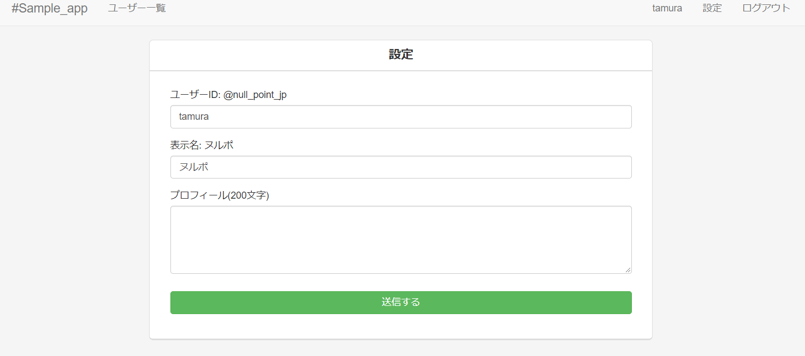

### validation の設定

* app/controllers/settings_controller.rb

```rb
class SettingsController < ApplicationController
  def edit
    @user = current_user
  end

   
  def update
    @user = current_user
    if @user.update(params_user)
      redirect_to user_url(@user)
    else
      render :edit
    end
  end

  private

  def params_user
    params.require(:user).permit(:name, :screen_name, :bio)
  end
end
```

* app/views/settings/edit.html.haml

```haml
#settings-edit
  .col-xs-6.settings-content
    - @user.errors.each do |attr, message|
      .alert.alert-danger= message
    = form_for @user, url: settings_path, method: :put do |f|
      %h2
        設定
      .form-body
        .form-group
          = f.label :name, "ユーザーID: @null_point_jp", class: "control-label"
          = f.text_field :name, class: "form-control"
        .form-group
          = f.label :screen_name, "表示名: ヌルポ", class: "control-label"
          = f.text_field :screen_name, class: "form-control"
        .form-group
          = f.label :bio, "プロフィール(200文字)", class: "control-label"
          = f.text_area :bio, class: "form-control"
        = f.submit "送信する", class: "btn btn-success"
```

### ログアウト機能

* app/controllers/sessions_controller.rb

```rb
class SessionsController < ApplicationController
  def new
    @user = User.new
  end

  def create
    email    = params_user[:email]
    password = params_user[:password]

    if login(email, password)
      redirect_to root_url, notice: "successfully logged in."
    else
      @user = User.new(email: email)
      render :new
    end
  end

  def destroy
    logout
    redirect_to root_url
  end

  private

  def params_user
    params.require(:user).permit(:email, :password)
  end
end
```

### Users#index, showをログインしていないと入れないようにする

* app/controllers/users_controller.rb

```rb
class UsersController < ApplicationController
  before_action :set_user, only: %i[ show edit update destroy ]
  before_filter :require_login
  # GET /users or /users.json
  def index
    @users = User.all
  end

  # GET /users/1 or /users/1.json
  def show
    @user = User.find(params[:id])
  end
end
```

### noticeの表示

Settings#edit の notice

* app/controllers/settings_controller.rb

```rb
class SettingsController < ApplicationController
  def edit
    @user = current_user
  end

   
  def update
    @user = current_user
    if @user.update(params_user)
      redirect_to user_url(@user), notice: "プロフィールを更新しました"
    else
      render :edit
    end
  end

  private

  def params_user
    params.require(:user).permit(:name, :screen_name, :bio)
  end
end
```

* app/views/users/show.html.haml

```haml
.col-xs-8#users-content
  .user-info
    - if notice
      .alert.alert-info= notice
    %span.user-name
      = @user.name
      = render_user_screen_name(@user)
    %span.user-id
      @#{@user.name}
    .bio
      = @user.bio
```

### Sessions#new の notice

* app/controllers/sessions_controller.rb

```rb
class SessionsController < ApplicationController
  def new
    @user = User.new
  end

  def create
    email    = params_user[:email]
    password = params_user[:password]

    if login(email, password)
      redirect_to root_url, notice: "サインインしました"
    else
      @user = User.new(email: email)
      render :new
    end
  end

  def destroy
    logout
    redirect_to root_url, notice: "サインアウトしました"
  end

  private

  def params_user
    params.require(:user).permit(:email, :password)
  end
end
```

* app/views/registrations/new.html.haml

```haml
#registrations-new
  .col-xs-6.left-content
    %h1 #Sample_app
    %p.ex
      このサイトは、シラバスのRails学習コースの完成形サンプルアプリです。
    %p.by
      開発者: @null_point デザイン: @null_point 企画: @null_point
    - if notice
       %p
         .alert.alert-info= notice
  .col-xs-6.right-content
    = form_for @user, url: registrations_path, method: :post do |f|
      %h2
        会員登録する
      - @user.errors.each do |attr, message|
        .alert.alert-danger= message
      .form-group
        = f.label :name, "ユーザーID: @@null_point_jp", class: "control-label"
        = f.text_field :name, class: "form-control"
      .form-group
        = f.label :email,"メールアドレス: hello@@null_point.jp", class: "control-label"
        = f.text_field :email, class: "form-control"
      .form-group
        = f.label :password, "パスワード: 6文字以上", class: "control-label"
        = f.password_field :password, class: "form-control"
      .form-group
        = f.label :password_confirmation, "確認用パスワード: 6文字以上", class: "control-label"
        = f.password_field :password_confirmation, class: "form-control"
      = f.submit "登録する", class: "btn btn-primary"
      = link_to "ログインする", new_sessions_path, class: "login pull-right"
      .clear
```

### tweet 機能のコード生成

ツイート機能を書く。ここはscaffoldを利用する。

```bash
rails g scaffold tweet user_id:integer content:string --no-stylesheets
```

### tweets テーブルにインデックスをはる

インデックスを追加して、読み取り、並べ替えを高速化する

tweets テーブルは user_id から参照されることが考えられるので、DB にインデックスをはっておく

* db/migrate/20210818142957_create_tweets.rb

```rb
class CreateTweets < ActiveRecord::Migration[6.1]
  def change
    create_table :tweets do |t|
      t.integer :user_id
      t.string :content

      t.timestamps
      
      t.index :user_id
      t.index :created_at
    end
  end
end
```

```bash
rake db:migrate
```

### ヘッダーに tweets#index へのリンクを置く

* app/views/layouts/_header.html.haml

```haml
.navbar.navbar-default
  .container
    .navbar-header
      = link_to '#Sample_app', root_url, class: "navbar-brand"
    - if logged_in?
      %ul.nav.navbar-nav
        %li= link_to "全ツイート一覧", tweets_path
        %li= link_to "ユーザー一覧", users_path
      %ul.nav.navbar-nav.navbar-right
        %li= link_to current_user.name, current_user
        %li= link_to "設定", edit_settings_path
        %li= link_to "ログアウト", sessions_path, method: :delete
    - else
      %ul.nav.navbar-nav.navbar-right
        %li= link_to "会員登録", new_registrations_path
        %li= link_to "ログイン", new_sessions_path
```

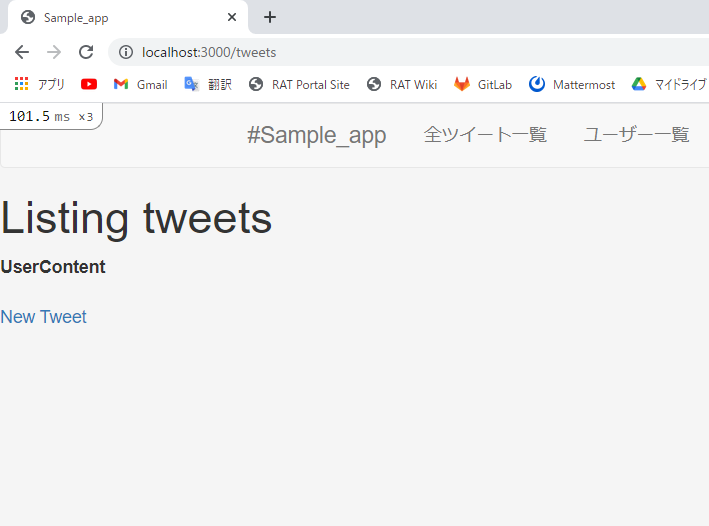

### サインアップ後にログインするようにする

* app/controllers/registrations_controller.rb

```rb
class RegistrationsController < ApplicationController
  def new
    @user = User.new
  end

  def create
    @user = User.new(params_user)

    if @user.save
      login(@user.email, @user.password)
      redirect_to root_url
    else
      render :new
    end
  end

  private

  def params_user
    params.require(:user).permit(:name, :email, :password, :password_confirmation)
  end
end
```

### Route 定義の順序の変更

* config/routes.rb

```rb
Rails.application.routes.draw do
  resource :registrations, only: [:new, :create]
  resource :sessions, only: [:new, :create, :destroy]
  resource :settings, only: [:edit, :update]
  resources :users, only: [:index, :show]

  resources :tweets
  
  root to: 'registrations#new'
  # For details on the DSL available within this file, see https://guides.rubyonrails.org/routing.html
end
```

### Controller 変更

scaffold で生成されたコードから変更を加える。

Tweet は必ず user と関連付けられていなければならない、というバリデーションを書いたので、user に current_user をセットする。

また、クライアントから送られてくるパラメーターのうち、user_id は current_user から取ってこれるので、こちらは不要になる。

* app/controllers/tweets_controller.rb

```rb
class TweetsController < ApplicationController
  before_action :set_tweet, only: %i[ show edit update destroy ]

  # GET /tweets or /tweets.json
  def index
    @tweets = Tweet.all
  end

  # GET /tweets/1 or /tweets/1.json
  def show
  end

  # GET /tweets/new
  def new
    @tweet = Tweet.new
  end

  # GET /tweets/1/edit
  def edit
  end

  # POST /tweets or /tweets.json
  def create
    @tweet = Tweet.new(tweet_params)
    @tweet.user = current_user

    respond_to do |format|
      if @tweet.save
        format.html { redirect_to @tweet, notice: "Tweet was successfully created." }
        format.json { render :show, status: :created, location: @tweet }
      else
        format.html { render :new, status: :unprocessable_entity }
        format.json { render json: @tweet.errors, status: :unprocessable_entity }
      end
    end
  end

  # PATCH/PUT /tweets/1 or /tweets/1.json
  def update
    respond_to do |format|
      if @tweet.update(tweet_params)
        format.html { redirect_to @tweet, notice: "Tweet was successfully updated." }
        format.json { render :show, status: :ok, location: @tweet }
      else
        format.html { render :edit, status: :unprocessable_entity }
        format.json { render json: @tweet.errors, status: :unprocessable_entity }
      end
    end
  end

  # DELETE /tweets/1 or /tweets/1.json
  def destroy
    @tweet.destroy
    respond_to do |format|
      format.html { redirect_to tweets_url, notice: "Tweet was successfully destroyed." }
      format.json { head :no_content }
    end
  end

  private
    # Use callbacks to share common setup or constraints between actions.
    def set_tweet
      @tweet = Tweet.find(params[:id])
    end

    # Only allow a list of trusted parameters through.
    def tweet_params
      params.require(:tweet).permit(:content)
    end
end
```

### ログインしていないと見れないようにする

ログインしていないと見れないようにする

* index (全ツイート一覧画面) はログインしていなくても見れるようにしたい
  * except オプションで指定する

* app/controllers/tweets_controller.rb

```rb
class TweetsController < ApplicationController
  before_action :require_login, except: [:index]
  before_action :set_tweet, only: %i[ show edit update destroy ]

  # GET /tweets or /tweets.json
  def index
    @tweets = Tweet.all
  end
```

### TweetモデルとUserモデルの関連付け(one to many関連)

* app/models/tweet.rb

```rb
class Tweet < ApplicationRecord
    belongs_to :user
end
```

* app/models/user.rb

```rb
class User < ApplicationRecord
  authenticates_with_sorcery!

  has_many :tweets, dependent: :destroy
  
  validates :name, presence: true, uniqueness: { case_sensitive: false }, format: { with: /\A[a-z][a-z0-9]+\z/ }, length: { in: 4..24 }
  validates :screen_name, length: { maximum: 140 }
  validates :bio, length: { maximum: 200  }
  validates :email, presence: true, uniqueness: { case_sensitive: false }
  validates :password, confirmation: true, length: { in: 6..24 }, if: :password
  validates :password_confirmation, presence: true, if: :password
end
```

### Tweet の Validation 定義

* app/models/tweet.rb

```rb
class Tweet < ApplicationRecord
    belongs_to :user

    validates :user, presence: true
	validates :content, presence: true, length: { in: 1..140}
end
```

### View(テンプレート)実装

* app/views/tweets/index.html.haml

```haml
#tweets-content
  .container
    .row
      .col-xs-4.left-content
        - if logged_in?
          .panel.panel-default
            .panel-body
              = link_to user_path(current_user), class: "user" do
                %span.user-name
                  = render_user_screen_name current_user
                %span.user-id
                  @#{current_user.name}
              .user-activity
                .row
                  .col-xs-4.tweets-num
                    .text
                      つぶやき
                    .num
                      = link_to current_user.tweets.count, user_path(current_user)
                  .col-xs-4.follow-num
                    .text
                      フォロー
                    .num
                      0
                  .col-xs-4.follower-num
                    .text
                      フォロワー
                    .num
                      0
      .col-xs-8.right-content
        .list-group
          = div_for @tweets, class: "list-group-item" do |t|
            %h4.user
              %span.user-name
                = link_to render_user_screen_name(t.user), user_path(t.user)
              %span.user-id
                @#{t.user.name}
              %span.time.pull-right
                = distance_of_time_in_words_to_now(t.created_at)
              .clear
            .tweet-content
              %p
                = t.content
```

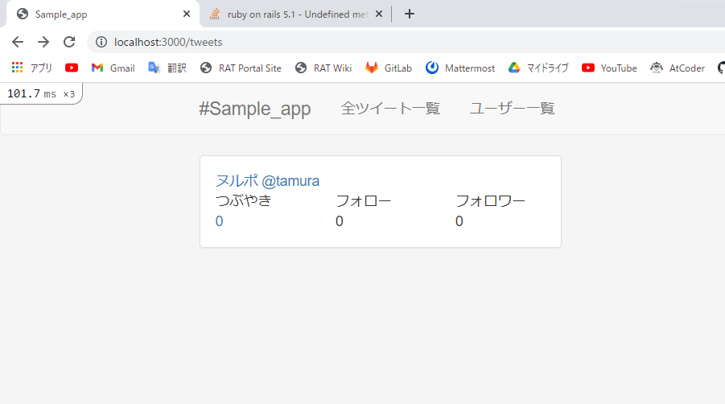

### つぶやきの作成時間を修整する

* config/locales/jp.yml

```yml
   date:
     abbr_day_names:
     - 日
     - 月
     - 火
     - 水
     - 木
     - 金
     - 土
     abbr_month_names:
     -
     - 1月
     - 2月
     - 3月
     - 4月
     - 5月
     - 6月
     - 7月
     - 8月
     - 9月
     - 10月
     - 11月
     - 12月
     day_names:
     - 日曜日
     - 月曜日
     - 火曜日
     - 水曜日
     - 木曜日
     - 金曜日
     - 土曜日
     formats:
       default: ! '%Y/%m/%d'
       long: ! '%Y年%m月%d日(%a)'
       short: ! '%m/%d'
     month_names:
     -
     - 1月
     - 2月
     - 3月
     - 4月
     - 5月
     - 6月
     - 7月
     - 8月
     - 9月
     - 10月
     - 11月
     - 12月
     order:
     - :year
     - :month
     - :day
   datetime:
     distance_in_words:
       about_x_hours:
         one: 約1時間
         other: 約%{count}時間
       about_x_months:
         one: 約1ヶ月
         other: 約%{count}ヶ月
       about_x_years:
         one: 約1年
         other: 約%{count}年
       almost_x_years:
         one: 1年弱
         other: ! '%{count}年弱'
       half_a_minute: 30秒前後
       less_than_x_minutes:
         one: 1分以内
         other: ! '%{count}分未満'
       less_than_x_seconds:
         one: 1秒以内
         other: ! '%{count}秒未満'
       over_x_years:
         one: 1年以上
         other: ! '%{count}年以上'
       x_days:
         one: 1日
         other: ! '%{count}日'
       x_minutes:
         one: 1分
         other: ! '%{count}分'
       x_months:
         one: 1ヶ月
         other: ! '%{count}ヶ月'
       x_seconds:
         one: 1秒
         other: ! '%{count}秒'
     prompts:
       day: 日
       hour: 時
       minute: 分
       month: 月
       second: 秒
       year: 年
   errors:
     format: ! '%{attribute}%{message}'
     messages:
       accepted: を受諾してください。
       blank: を入力してください。
       present: は入力しないでください。
       confirmation: と%{attribute}の入力が一致しません。
       empty: を入力してください。
       equal_to: は%{count}にしてください。
       even: は偶数にしてください。
       exclusion: は予約されています。
       greater_than: は%{count}より大きい値にしてください。
       greater_than_or_equal_to: は%{count}以上の値にしてください。
       inclusion: は一覧にありません。
       invalid: は不正な値です。
       less_than: は%{count}より小さい値にしてください。
       less_than_or_equal_to: は%{count}以下の値にしてください。
       not_a_number: は数値で入力してください。
       not_an_integer: は整数で入力してください。
       odd: は奇数にしてください。
       record_invalid: バリデーションに失敗しました。 %{errors}
       restrict_dependent_destroy: ! '%{record}が存在しているので削除できません。'
       taken: はすでに存在します。
       too_long: は%{count}文字以内で入力してください。
       too_short: は%{count}文字以上で入力してください。
       wrong_length: は%{count}文字で入力してください。
       other_than: "は%{count}以外の値にしてください。"
     template:
       body: 次の項目を確認してください。
       header:
         one: ! '%{model}にエラーが発生しました。'
         other: ! '%{model}に%{count}個のエラーが発生しました。'
   helpers:
     select:
       prompt: 選択してください。
     submit:
       create: 登録する
       submit: 保存する
       update: 更新する
   number:
     currency:
       format:
         delimiter: ! ','
         format: ! '%n%u'
         precision: 0
         separator: .
         significant: false
         strip_insignificant_zeros: false
         unit: 円
     format:
       delimiter: ! ','
       precision: 3
       separator: .
       significant: false
       strip_insignificant_zeros: false
     human:
       decimal_units:
         format: ! '%n %u'
         units:
           billion: 十億
           million: 百万
           quadrillion: 千兆
           thousand: 千
           trillion: 兆
           unit: ''
       format:
         delimiter: ''
         precision: 3
         significant: true
         strip_insignificant_zeros: true
       storage_units:
         format: ! '%n%u'
         units:
           byte: バイト
           gb: ギガバイト
           kb: キロバイト
           mb: メガバイト
           tb: テラバイト
     percentage:
       format:
         delimiter: ''
         format: "%n%"
     precision:
       format:
         delimiter: ''
   support:
     array:
       last_word_connector: と
       two_words_connector: と
       words_connector: と
   time:
     am: 午前
     formats:
       default: ! '%Y/%m/%d %H:%M:%S'
       long: ! '%Y年%m月%d日(%a) %H時%M分%S秒 %z'
       short: ! '%y/%m/%d %H:%M'
     pm: 午後
```

### ツイート一覧画面から、ツイートを投稿できるようにする

* app/controllers/tweets_controller.rb

```rb
class TweetsController < ApplicationController
  #before_filter :require_login, except: [:index]
  before_action :set_tweet, only: %i[ show edit update destroy ]

  # GET /tweets or /tweets.json
  def index
    @tweets = Tweet.all
    @tweet  = Tweet.new
  end
```

* app/views/tweets/index.html.haml

```haml
#tweets-content
  .container
    .row
      .col-xs-4.left-content
        - if logged_in?
          .panel.panel-default
            .panel-body
              = link_to user_path(current_user), class: "user" do
                %span.user-name
                  = render_user_screen_name current_user
                %span.user-id
                  @#{current_user.name}
              .user-activity
                .row
                  .col-xs-4.tweets-num
                    .text
                      つぶやき
                    .num
                      = link_to current_user.tweets.count, user_path(current_user)
                  .col-xs-4.follow-num
                    .text
                      フォロー
                    .num
                      0
                  .col-xs-4.follower-num
                    .text
                      フォロワー
                    .num
                      0
              = form_for @tweet do |f|
                  .form-group
                    = f.text_area :content, class: "form-control"
                  = f.submit "つぶやく", class: "btn btn-success"
      .col-xs-8.right-content
        .list-group
          = div_for @tweets, class: "list-group-item" do |t|
            %h4.user
              %span.user-name
                = link_to render_user_screen_name(t.user), user_path(t.user)
              %span.user-id
                @#{t.user.name}
              %span.time.pull-right
                = distance_of_time_in_words_to_now(t.created_at)
              .clear
            .tweet-content
              %p
                = t.content
```

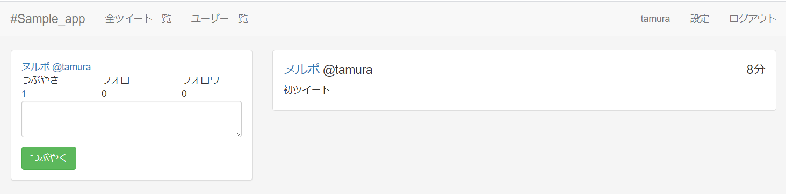

* app/assets/stylesheets/application.css.sass

```sass
/*
 * This is a manifest file that'll be compiled into application.css, which will include all the files
 * listed below.
 *
 * Any CSS and SCSS file within this directory, lib/assets/stylesheets, vendor/assets/stylesheets,
 * or vendor/assets/stylesheets of plugins, if any, can be referenced here using a relative path.
 *
 * You're free to add application-wide styles to this file and they'll appear at the bottom of the
 * compiled file so the styles you add here take precedence over styles defined in any styles
 * defined in the other CSS/SCSS files in this directory. It is generally better to create a new
 * file per style scope.
 *
 *= require_tree .
 *= require_self
 */

@import bootstrap

html, body
  width: 100%
  height: 100%

#application
  background-color: #f5f5f5

.clear
  clear: both

#users-content
  float: none
  margin: 0 auto 35px
  padding: 0px
  background-color: #fff
  border: 1px solid #ddd
  border-radius: 6px
  border-bottom-width: 3px
  .list-group
    margin-bottom: -1px
    .list-group-item
      border: none
      border-bottom: 1px solid #ddd
      margin-bottom: 0px
      &:last-child
      .user
        .user-name
          a
            color: #555
        .user-id
          font-size: 14px
          color: #aaa
          font-weight: 400
        .time
          font-size: 12px
          color: #aaa
          font-weight: 400
    .user-list
      border-bottom-width: 2px
      h2
        font-size: 20px
        margin: 0px
  .user-info
    padding: 20px 35px
    .user-name
      font-size: 28px
      font-weight: 600
    .user-id
      font-size: 18px
      color: #aaa
    .bio
      margin-top: 5px
  .nav.nav-tabs
    border-top: 1px solid #ddd
    border-bottom: 2px solid #ddd
    li
      a
        border: none
        &:hover
          background-color: #fff
        .text
        .num
          font-size: 28px

#tweets-content
  .left-content
    .panel
      box-shadow: none
      border-bottom-width: 3px
      .user
        .user-name
          font-size: 20px
          font-weight: 600
          color: #555
        .user-id
          color: #aaa
        &:hover
          text-decoration: none
          border-bottom: 1px solid #555
      .user-activity
        text-align: center
        .row
          border-bottom: 1px solid #ddd
          padding: 10px 0px
          .text
            font-size: 12px
            color: #777
          .num
            font-size: 18px
      .new_tweet
        margin-top: 20px
        textarea
          width: 100% !important
        .btn
          width: 100%
  .right-content
    .list-group-item:last-child
      border-bottom-width: 3px
    .list-group-item
      .user
        .user-name
          a
            color: #555
        .user-id
          font-size: 14px
          color: #aaa
          font-weight: 400
        .time
          font-size: 12px
          color: #aaa
          font-weight: 400
      .tweet-content
        font-size: 16px
        .content-footer
          a
            font-size: 12px
            margin-right: 10px
```

### 投稿後は、ツイート一覧画面にリダイレクトする

* app/controllers/tweets_controller.rb

```rb
class TweetsController < ApplicationController
  #before_filter :require_login, except: [:index]
  before_action :set_tweet, only: %i[ show edit update destroy ]

  # GET /tweets or /tweets.json
  def index
    @tweets = Tweet.all
    @tweet  = Tweet.new
  end

  # GET /tweets/1 or /tweets/1.json
  def show
  end

  # GET /tweets/new
  def new
    @tweet = Tweet.new
  end

  # GET /tweets/1/edit
  def edit
  end

  # POST /tweets or /tweets.json
  def create
    @tweet = Tweet.new(tweet_params)
    @tweet.user = current_user

    respond_to do |format|
      if @tweet.save
        format.html { redirect_to tweets_url, notice: 'Tweet was successfully created.' }
        format.json { render :show, status: :created, location: @tweet }
      else
        format.html { render :new, status: :unprocessable_entity }
        format.json { render json: @tweet.errors, status: :unprocessable_entity }
      end
    end
  end
```

### ツイート投稿失敗した場合のメッセージ表示

```rb
class TweetsController < ApplicationController
  #before_filter :require_login, except: [:index]
  before_action :set_tweet, only: %i[ show edit update destroy ]

  # GET /tweets or /tweets.json
  def index
    @tweets = Tweet.all
    @tweet  = Tweet.new
  end

  # GET /tweets/1 or /tweets/1.json
  def show
  end

  # GET /tweets/new
  def new
    @tweet = Tweet.new
  end

  # GET /tweets/1/edit
  def edit
  end

  # POST /tweets or /tweets.json
  def create
    @tweet = Tweet.new(tweet_params)
    @tweet.user = current_user

    respond_to do |format|
      if @tweet.save
        format.html { redirect_to tweets_url, notice: 'Tweet was successfully created.' }
        format.json { render :show, status: :created, location: @tweet }
      else
        @tweets = Tweet.all
        format.html { render :index }
        format.json { render json: @tweet.errors, status: :unprocessable_entity }
      end
    end
  end
```

* app/views/tweets/index.html.haml

```haml
#tweets-content
  .container
    .row
      .col-xs-4.left-content
        - if logged_in?
          .panel.panel-default
            .panel-body
              = link_to user_path(current_user), class: "user" do
                %span.user-name
                  = render_user_screen_name current_user
                %span.user-id
                  @#{current_user.name}
              .user-activity
                .row
                  .col-xs-4.tweets-num
                    .text
                      つぶやき
                    .num
                      = link_to current_user.tweets.count, user_path(current_user)
                  .col-xs-4.follow-num
                    .text
                      フォロー
                    .num
                      0
                  .col-xs-4.follower-num
                    .text
                      フォロワー
                    .num
                      0
              - @tweet.errors.full_messages.each do |message|
                .alert.alert-danger= message
              = form_for @tweet do |f|
                .form-group
                  = f.text_area :content, class: "form-control"
                = f.submit "つぶやく", class: "btn btn-success"
      .col-xs-8.right-content
        .list-group
          = div_for @tweets, class: "list-group-item" do |t|
            %h4.user
              %span.user-name
                = link_to render_user_screen_name(t.user), user_path(t.user)
              %span.user-id
                @#{t.user.name}
              %span.time.pull-right
                = distance_of_time_in_words_to_now(t.created_at)
              .clear
            .tweet-content
              %p
                = t.content
```

### Tweetを新しい順で並べ替える

* app/models/tweet.rb

```rb
class Tweet < ApplicationRecord
    belongs_to :user

    validates :user, presence: true
	validates :content, presence: true, length: { in: 1..140}

    default_scope -> { order(created_at: :desc) }
end
```

* app/views/tweets/index.html.haml

```haml
#tweets-content
  .container
    .row
      .col-xs-4.left-content
        - if logged_in?
          .panel.panel-default
            .panel-body
              = link_to user_path(current_user), class: "user" do
                %span.user-name
                  = render_user_screen_name current_user
                %span.user-id
                  @#{current_user.name}
              .user-activity
                .row
                  .col-xs-4.tweets-num
                    .text
                      つぶやき
                    .num
                      = link_to current_user.tweets.count, user_path(current_user)
                  .col-xs-4.follow-num
                    .text
                      フォロー
                    .num
                      0
                  .col-xs-4.follower-num
                    .text
                      フォロワー
                    .num
                      0
              - @tweet.errors.full_messages.each do |message|
                .alert.alert-danger= message
              = form_for @tweet do |f|
                .form-group
                  = f.text_area :content, class: "form-control"
                = f.submit "つぶやく", class: "btn btn-success"
      .col-xs-8.right-content
        - if notice
          .alert.alert-info= notice
        .list-group
          = div_for @tweets, class: "list-group-item" do |t|
            %h4.user
              %span.user-name
                = link_to render_user_screen_name(t.user), user_path(t.user)
              %span.user-id
                @#{t.user.name}
              %span.time.pull-right
                = distance_of_time_in_words_to_now(t.created_at)
              .clear
            .tweet-content
              %p
                = t.content
```

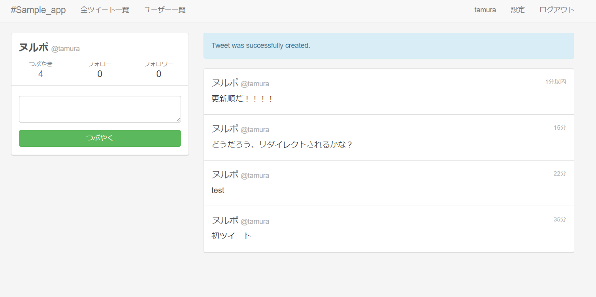

### Users#showの内容を調整

```haml
      @#{@user.name}
    .bio
      = @user.bio

  %ul.nav.nav-tabs.nav-justified
    %li.active
      = link_to user_path(@user) do
        .text
          つぶやき
        .num
          #{@user.tweets.count}
    %li
      = link_to nil do
        .text
          フォロー
        .num
          0
    %li
      = link_to nil do
        .text
          フォロワー
        .num
          0
    %li
      = link_to nil do
        .text
          お気に入り
        .num
          0

  .list-group
    - if @user.tweets.empty?
      .list-group-item
        まだツイートはありません
    = div_for @user.tweets, class: "list-group-item" do |t|
      %h4.user
        %span.user-name
          = link_to t.user.name, user_path(t.user)
        %span.user-id
          @#{t.user.name}
        %span.time.pull-right
          = distance_of_time_in_words_to_now(t.created_at)
        .clear
      .tweet-content
        %p
          = t.content
```

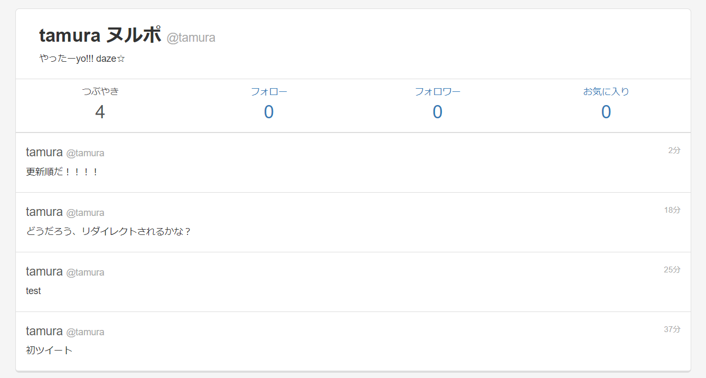

### ログインしている場合はタイムラインを表示する

* app/controllers/registrations_controller.rb

```rb
class RegistrationsController < ApplicationController
  def new
    @user = User.new
    redirect_to tweets_url if logged_in?
  end

  def create
    @user = User.new(params_user)

    if @user.save
      login(@user.email, @user.password)
      redirect_to root_url
    else
      render :new
    end
  end

  private

  def params_user
    params.require(:user).permit(:name, :email, :password, :password_confirmation)
  end
end
```

* app/controllers/sessions_controller.rb

```rb
class SessionsController < ApplicationController
  def new
    @user = User.new
    redirect_to tweets_url if logged_in?
  end

  def create
    email    = params_user[:email]
    password = params_user[:password]

    if login(email, password)
      redirect_to root_url, notice: "サインインしました"
    else
      @user = User.new(email: email)
      render :new
    end
  end

  def destroy
    logout
    redirect_to root_url, notice: "サインアウトしました"
  end

  private

  def params_user
    params.require(:user).permit(:email, :password)
  end
end
```

### 会員登録後タイムラインを表示

* app/controllers/registrations_controller.rb

```rb
class RegistrationsController < ApplicationController
  def new
    @user = User.new
    redirect_to tweets_url if logged_in?
  end

  def create
    @user = User.new(params_user)

    if @user.save
      login(@user.email, @user.password)
      redirect_to tweets_url
    else
      render :new
    end
  end

  private

  def params_user
    params.require(:user).permit(:name, :email, :password, :password_confirmation)
  end
end
```

### ログイン後タイムラインを表示

```rb
class SessionsController < ApplicationController
  def new
    @user = User.new
    redirect_to tweets_url if logged_in?
  end

  def create
    email    = params_user[:email]
    password = params_user[:password]

    if login(email, password)
      redirect_to tweets_url, notice: "サインインしました"
    else
      @user = User.new(email: email)
      render :new
    end
  end

  def destroy
    logout
    redirect_to root_url, notice: "サインアウトしました"
  end

  private

  def params_user
    params.require(:user).permit(:email, :password)
  end
end
```

## お気に入り機能

### favorite-many-to-many連携のための中間テーブル生成

```bash
$ rails g model favorite user_id:integer tweet_id:integer
```

### favorite-インデックスの追加と高速化

user_id からも tweet_id からも参照される可能性があるため、インデックスを貼る

* db/migrate/20141123081706_create_favorites.rb 
```ruby
class CreateFavorites < ActiveRecord::Migration[6.1]
  def change
    create_table :favorites do |t|
      t.integer :user_id
      t.integer :tweet_id

      t.timestamps

      t.index :user_id
      t.index :tweet_id
      t.index :created_at
    end
  end
end
```

### favorite-マイグレーションを実行

```bash
$ rake db:migrate
```

### favorite-ルーティングの定義

* favorite の many to many 連携のうち、片方はユーザーで、かつアクセスしてきた人のアカウント(current_user)
* よってプライマリキーをurlに含めて受け取る必要はない
* なので、入れ子にしたresourceメソッドを用いる

* config/routes.rb 
```ruby
   resource :sessions, only: [:new, :create, :destroy]
   resource :settings, only: [:edit, :update]
   resources :users, only: [:index, :show]
   resources :tweets do
     resource :favorites, only: [:create, :destroy]
   end
 
   root to: 'registrations#new' 
```

* config/routes.rb 
```ruby
   resource :registrations, only: [:new, :create]
   resource :sessions, only: [:new, :create, :destroy]
   resource :settings, only: [:edit, :update]
 
   resources :users, only: [:index, :show] do
     get :favorites, on: :member
   end
 
   resources :tweets do
     resource :favorites, only: [:create, :destroy]
   end 
```

### favorite-コントローラーの作成

今回はコントローラーを手動で生成

* app/controllers/favorites_controller.rb 
```ruby
 class FavoritesController < ApplicationController
 end 
```

* befor_action :require_login でログインしていなければリダイレクトさせる
* ログインしていなければ、createメソッドの本体が実行されない、という前提のおかげで、current_userが必ず存在することになる

* お気に入りモデルのインスタンスをbuildメソッドで生成、それの保存を試みる

* app/controllers/favorites_controller.rb 
```ruby
 class FavoritesController < ApplicationController
   before_action :require_login
 
   def create
     @tweet    = Tweet.find(params[:tweet_id])
     @favorite = current_user.favorites.build(tweet: @tweet)
 
     if @favorite.save
       redirect_to tweets_url, notice: "お気に入りに登録しました"
     else
       redirect_to tweets_url, alert: "このツイートはお気に入りに登録できません"
    end
   end
 end 
```

* find_by / find_by! メソッドはプライマリキーでないカラムを1件取得するもの
* ! がついていると、該当レコードがなかった場合に例外が飛ぶ
* この例外は RecordNotFoundという例外で、最終的にHTTPステータスコード404の「Not Found」になる

* 
```ruby
       redirect_to tweets_url, alert: "このツイートはお気に入りに登録できません"
    end
   end
 
   def destroy
     @favorite = current_user.favorites.find_by!(tweet_id: params[:tweet_id])
     @favorite.destroy
     redirect_to tweets_url, notice: "お気に入りを解除しました"
   end
 end 
```

* User#showにお気に入り一覧を表示

* app/controllers/users_controller.rb 
```ruby
   def show
     @user = User.find(params[:id])
   end
 
   def favorites
     @user = User.find(params[:id])
   end
 end 
```

### favorite-モデルの記述

- User, Tweet, Favoriteの関連付け
  - many to many連携の定義
  - Tweet も User も、Favoriteを複数持っていて、Favorite から見ると1つの User、1つのTweetに属している。

* app/models/favorite.rb 
```ruby
 class Favorite < ActiveRecord::Base
   belongs_to :user
   belongs_to :tweet
 end 
```

* app/models/tweet.rb 
```
 class Tweet < ActiveRecord::Base
   belongs_to :user
   has_many :favorites, dependent: :destroy
 
   validates :user, presence: true
   validates :content, presence: true, length: { in: 1..140 } 
```

* app/models/user.rb 
```
   authenticates_with_sorcery!
 
   has_many :tweets, dependent: :destroy
   has_many :favorites, dependent: :destroy
 
   validates :name, presence: true, uniqueness: { case_sensitive: false }, format: { with: /\A[a-z][a-z0-9]+\z/ }, length: { in: 4..24 }
   validates :screen_name, length: { maximum: 140 } 
```

- バリデーション定義
  - User と Tweet を持っていることは必要だが、お気に入りの場合は同じ人が同じツイートを複数ふぁぼることはできない
  - scope付きのuniqueness制約を与える

* app/models/favorite.rb 
```ruby
 class Favorite < ActiveRecord::Base
   belongs_to :user
   belongs_to :tweet
 
   validates :user, presence: true
   validates :user_id, uniqueness: { scope: :tweet_id }
   validates :tweet, presence: true
 end 
```

- お気に入り登録しているかどうか、を返すメソッドの定義
  - お気に入りしているかどうか、によって表示するボタンを変えたい
  - そのtrue, falseを返すメソッドをモデルに実装する

* app/models/tweet.rb 
```ruby
   validates :user, presence: true
   validates :content, presence: true, length: { in: 1..140 }
 
   def favorited_by? user
     favorites.where(user_id: user.id).exists?
   end
 end 
```

* なお、モデル定義内でcurrent_userは使用できない
* モデルはDBのレコードに対応する概念であり、通信にかかわるような情報とは関係を持たない

### favorite-Viewを調整

* つぶやき一覧にお気に入りリンクを配置

* app/views/tweets/index.html.haml 
```ruby
             .tweet-content
               %p
                 = t.content
               .content-footer
                 = link_to "お気に入りに登録", tweet_favorites_path(t), method: :pos
```

* app/views/tweets/index.html.haml 
```ruby
               %p
                 = t.content
               .content-footer
                 - if t.favorited_by? current_user
                   = link_to "お気に入りの解除", tweet_favorites_path(t), method: :delete
                 - else
                   = link_to "お気に入りに登録", tweet_favorites_path(t), method: :post 
```

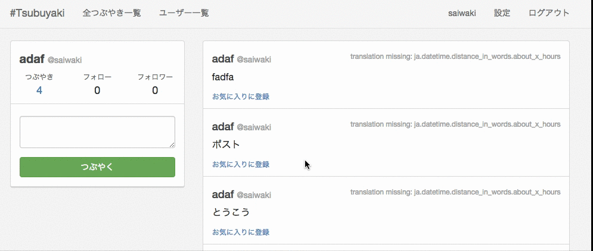

* user/_headerパーシャルの作成
  * app/views/users/show.html.haml の内容を app/views/users/_header.html.haml にコピペする

* app/views/users/_header.html.haml 
```haml
.user-info
  - if notice
    .alert.alert-info= notice
  %span.user-name
    = render_user_screen_name(@user)
  %span.user-id
    @#{@user.name}
  .bio
    = @user.bio

%ul.nav.nav-tabs.nav-justified
  %li.active
    = link_to user_path(@user) do
      .text
        つぶやき
      .num
        #{@user.tweets.count}
  %li
    = link_to nil do
      .text
        フォロー
      .num
        0
  %li
    = link_to nil do
      .text
        フォロワー
      .num
        0
  %li
    = link_to nil do
      .text
        お気に入り
      .num
        0
```

* app/views/users/show.html.haml 
```haml
.col-xs-8#users-content

  .list-group
    - if @user.tweets.empty? 
```

* リンク先を設定

* app/views/users/_header.html.haml 
```haml
      .num
        0
  %li
    = link_to favorites_user_path(@user) do
      .text
        お気に入り
      .num 
```

* パーシャルを読み込む

* app/views/users/show.html.haml 
```haml
.col-xs-8#users-content
  = render partial: "users/header"
  .list-group
    - if @user.tweets.empty?
      .list-group-item 
```

* アクティブ表示

* app/views/users/_header.html.haml 
```haml
    = @user.bio

%ul.nav.nav-tabs.nav-justified
  %li{ class: action_name == "show" ? "active" : nil }
    = link_to user_path(@user) do
      .text
        つぶやき
	
    ...

        フォロワー
      .num
        0
  %li{ class: action_name == "favorites" ? "active" : nil }
    = link_to favorites_user_path(@user) do
      .text
        お気に入り 
```

* users/_tweetパーシャルの作成
  * users/show から users/_tweet にコピペ

* app/views/users/_tweet.html.haml 
```haml
= div_for @user.tweets, class: "list-group-item" do |t|
  %h4.user
    %span.user-name
      = link_to t.user.name, user_path(t.user)
    %span.user-id
      @#{t.user.name}
    %span.time.pull-right
      = distance_of_time_in_words_to_now(t.created_at)
    .clear
  .tweet-content
    %p
      = t.content 
```

* app/views/users/show.html.haml 
```haml
    - if @user.tweets.empty?
      .list-group-item
        まだツイートはありません
```

* app/views/users/_tweet.html.haml 
```haml
= div_for tweet, class: "list-group-item" do |t|
  %h4.user
    %span.user-name
      = link_to t.user.name, user_path(t.user) 
```

* app/views/users/show.html.haml 
```haml
    - if @user.tweets.empty?
      .list-group-item
        まだツイートはありません
    = render partial: "users/tweet", collection: @user.tweets 
```

* お気に入り一覧viewを作成

* app/views/users/favorites.html.haml
```haml 
.col-xs-8#users-content
  = render partial: "users/header"
  .list-group
    - if @user.favorites.empty?
      .list-group-item
        まだお気に入りに登録されたツイートはありません
    = render partial: "users/tweet", collection: @user.favorites.map{|f| f.tweet}
```

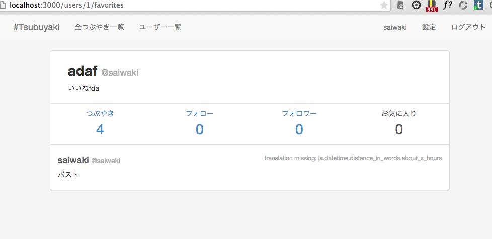

## フォロー機能

* フォローする / フォローを解除する の実装
* フォロー一覧 / フォロワー一覧を表示(User#showと同じ画面)
* フォローしている人のみのタイムラインを作成

### follow-many-to-many連携のための中間テーブル生成

* favorite機能と同様
* 中間テーブルが、belongs_toする先がどちらもUserモデルになるため、名前衝突の可能性あり
* userではない別の名前を与えなきゃいけないことに注意

```bash
$ rails g model follow follower_id:integer inverse_follower_id:integer
```

### follow-インデックスを追加して高速化

* db/migrate/20141123090723_create_follows.rb 
```ruby
      t.integer :inverse_follower_id

      t.timestamps

      t.index :follower_id
      t.index :inverse_follower_id
    end
  end
end 
```

### follow-マイグレーションを実行

```bash
$ rake db:migrate
```

### follow-ルーティングを定義

* favorite機能と同様

* follow機能を実装

* config/routes.rb 
```ruby
  resource :settings, only: [:edit, :update]

  resources :users, only: [:index, :show] do
    resource :follows, only: [:create, :destroy]
    get :favorites, on: :member
  end 
```

* フォロー一覧 / フォロワー一覧を表示

* config/routes.rb 
```rb
    resource :follows, only: [:create, :destroy]
    get :favorites, on: :member
    get :follows, on: :member
    get :followers, on: :member
  end

  resources :tweets do
```

* フォロワーのみのタイムラインを作成

* config/routes.rb 
```ruby

  resources :tweets do
    resource :favorites, only: [:create, :destroy]
    get :timeline, on: :collection
  end

  root to: 'registrations#new' 
```

### follow-コントローラーの作成

- follow機能を実装
  - 手動でfollows_controller.rbを作成

* app/controllers/follows_controller.rb 
```ruby
class FollowsController < ApplicationController
  before_filter :require_login

  def create
    @user = User.find(params[:user_id])

    if @user.inverse_follows.create(follower: current_user)
      redirect_to tweets_url, notice: "フォローしました"
    else
      redirect_to tweets_url, alert: "フォローできません"
    end
  end

  def destroy
    @user = User.find(params[:user_id])
    follow = @user.inverse_follows.find_by(follower: current_user.id)
    follow.destroy
    redirect_to tweets_url, notice: "フォローを解除しました"
  end
end 
```

* フォロー一覧 & フォロワー一覧を表示

* app/controllers/users_controller.rb 
```ruby
  def favorites
    @user = User.find(params[:id])
  end

  def follows
    @user = User.find(params[:id])
  end

  def followers
    @user = User.find(params[:id])
  end 
 end 
```

* フォロワーのみのタイムラインを作成

* app/controllers/tweets_controller.rb 
```ruby
    @tweet  = Tweet.new
  end

  def timeline
    @tweets = Tweet.eager_load(user: :inverse_follows).where(follows: { follower_id: current_user.id })
    @tweet  = Tweet.new
  end

  # GET /tweets/1
  # GET /tweets/1.json
  def show 
```

### follow-モデルを記述

- User, Followの関連付け
  - follower :　フォローした人, inverse_follower : フォローされた人 とする
  - 関連するモデル名(User)と、belongs_toする名前(followers, inverse_follower)が異なっている
  - どのモデルなのかを示すため、class_nameオプションを指定する必要がある

* app/models/follow.rb 
```ruby
class Follow < ActiveRecord::Base
  belongs_to :follower, class_name: 'User'
  belongs_to :inverse_follower, class_name: 'User'
end 
```

* app/models/user.rb 
```ruby
  has_many :tweets, dependent: :destroy
  has_many :favorites, dependent: :destroy

  has_many :follows, foreign_key: :follower_id
  has_many :inverse_followers, through: :follows
  has_many :inverse_follows, foreign_key: :inverse_follower_id, class_name: 'Follow'
  has_many :followers, through: :inverse_follows

  validates :name, presence: true, uniqueness: { case_sensitive: false }, format: { with: /\A[a-z][a-z0-9]+\z/ }, length: { in: 4..24 }
  validates :screen_name, length: { maximum: 140 }
  validates :bio, length: { maximum: 200  } 
```

- バリデーションを定義
  - favorite機能と同様

* app/models/follow.rb 
```ruby
class Follow < ActiveRecord::Base
  belongs_to :follower, class_name: User
  belongs_to :inverse_follower, class_name: User

  validates :follower, presence: true
  validates :inverse_follower, presence: true
  validates :inverse_follower_id, uniqueness: { scope: :follower_id }
end 
```

* フォロー済みかどうか、を返すメソッドを定義

* app/models/user.rb 
```ruby
  validates :email, presence: true, uniqueness: { case_sensitive: false }
  validates :password, confirmation: true, length: { in: 6..24 }, if: :password
  validates :password_confirmation, presence: true, if: :password

  def followed_by? user
    inverse_follows.where(follower_id: user.id).exists?
  end
end 
```

### follow-Viewを調整

* follow機能を実装

* app/views/tweets/index.html.haml 
```haml
                  = link_to "お気に入りの解除", tweet_favorites_path(t), method: :delete
                - else
                  = link_to "お気に入りに登録", tweet_favorites_path(t), method: :post
                - if t.user.followed_by? current_user
                  = link_to "フォロー解除", user_follows_path(t.user), method: :delete
                - else
                  = link_to "フォロー", user_follows_path(t.user), method: :post
```

* フォロー一覧 & フォロワー一覧を表示

* app/views/users/_header.html.haml
```haml
      .num
        #{@user.tweets.count}
  %li
    = link_to follows_user_path(@user) do
      .text
        フォロー
      .num 
```

* app/views/users/follows.html.haml 
```haml
.col-xs-8#users-content
  = render partial: "users/header"
  .list-group 
```

* app/views/users/_user.html.haml 
```haml
= div_for user, class: "list-group-item" do |u|
  %h4.user
    %span.user-name
      = link_to u.name, user_path(u)
    %span.user-id
      @#{u.name}
  .bio
    = u.bio
  .follow-unfollow
    - if u.followed_by? current_user
      = link_to "フォロー解除", user_follows_path(u), method: :delete
    - else
      = link_to "フォロー", user_follows_path(u), method: :post 
```

* app/views/users/follows.html.haml
```haml
.col-xs-8#users-content
  = render partial: "users/header"
  .list-group
    = render @user.inverse_followers 
```

* app/views/users/_header.html.haml 
```haml
      .num
        0
  %li
    = link_to followers_user_path(@user) do
      .text
        フォロワー
      .num 
```

* follows.html.hamlからコピペ+変更

* app/views/users/followers.html.haml 
```haml
.col-xs-8#users-content
  = render partial: "users/header"
  .list-group
    = render @user.followers 
```

* app/views/users/_header.html.haml 
```haml
      .text
        フォロー
      .num
        #{@user.inverse_followers.count}
  %li{ class: action_name == "followers" ? "active" : nil }
    = link_to followers_user_path(@user) do
      .text
        フォロワー
      .num
        #{@user.followers.count}
  %li{ class: action_name == "favorites" ? "active" : nil }
    = link_to favorites_user_path(@user) do
      .text
        お気に入り
      .num
        #{@user.favorites.count}
```

* app/views/users/index.html.haml 
```haml
  .list-group
    .list-group-item.user-list
      %h2 ユーザー一覧
    = render partial: "users/user", collection: @users 
```

* app/views/tweets/index.html.haml 
```haml
                    .text
                      フォロー
                    .num
                      = link_to current_user.inverse_followers.count, follows_user_path(current_user)
                  .col-xs-4.follower-num
                    .text
                      フォロワー
                    .num
                      = link_to current_user.followers.count, followers_user_path(current_user)
              - @tweet.errors.full_messages.each do |message|
                .alert.alert-danger= message
              = form_for @tweet do |f| 
```

* tweets/index から tweets/_panel にコピペ

* app/views/tweets/_panel.html.haml 
```haml
- if logged_in?
  .panel.panel-default
    .panel-body
      = link_to user_path(current_user), class: "user" do
        %span.user-name
          = render_user_screen_name current_user
        %span.user-id
          @#{current_user.name}
      .user-activity
        .row
          .col-xs-4.tweets-num
            .text
              つぶやき
            .num
              = link_to current_user.tweets.count, user_path(current_user)
          .col-xs-4.follow-num
            .text
              フォロー
            .num
              = link_to current_user.inverse_followers.count, follows_user_path(current_user)
          .col-xs-4.follower-num
            .text
              フォロワー
            .num
              = link_to current_user.followers.count, followers_user_path(current_user)
      - @tweet.errors.full_messages.each do |message|
        .alert.alert-danger= message
      = form_for @tweet do |f|
        .form-group
          = f.text_area :content, class: "form-control"
        = f.submit "つぶやく", class: "btn btn-success" 
```

* app/views/tweets/index.html.haml 
```haml
  .container
    .row
      .col-xs-4.left-content
        = render partial: "panel" 
      .col-xs-8.right-content
        - if notice
          .alert.alert-info= notice 
```

* tweets/index から tweets/_tweetにコピペ
```haml
            .tweet-content
              %p
                = t.content
              .content-footer
                - if t.favorited_by? current_user
                  = link_to "お気に入りの解除", tweet_favorites_path(t), method: :delete
                - else
                  = link_to "お気に入りに登録", tweet_favorites_path(t), method: :post
                - if t.user.followed_by? current_user
                  = link_to "フォロー解除", user_follows_path(t.user), method: :delete
                - else
                  = link_to "フォロー", user_follows_path(t.user), method: :post 
```

- フォロワーのみのタイムラインを作成
  - tweets/index から tweets/timeline にコピペ

* app/views/tweets/index.html.haml 
```haml
        - if notice
          .alert.alert-info= notice
        .list-group
          = render partial: "users/tweet", collection: @tweets 
```

* app/views/tweets/timeline.html.haml 
```haml
#tweets-content
  .container
    .row
      .col-xs-4.left-content
        = render partial: "panel"
      .col-xs-8.right-content
        - if notice
          .alert.alert-info= notice
        .list-group
          = render partial: "users/tweet", collection: @tweets 
```

* app/views/tweets/index.html.haml 
```haml
        - if notice
          .alert.alert-info= notice
        .list-group
          .list-group-item
            .btn-group
              = link_to "すべてのつぶやき", tweets_path, class: "active btn btn-primary"
              = link_to "フォローしている人のつぶやき", timeline_tweets_path, class: "btn btn-default"
          = render partial: "users/tweet", collection: @tweets 
```

* app/views/tweets/timeline.html.haml 
```haml
        - if notice
          .alert.alert-info= notice
        .list-group
          .list-group-item
            .btn-group
              = link_to "すべてのつぶやき", tweets_path, class: "active btn btn-primary"
              = link_to "フォローしている人のつぶやき", timeline_tweets_path, class: "btn btn-default"
          = render partial: "users/tweet", collection: @tweets 
```

### follow-お気に入りorフォローしたとき、リファラを使って同じ画面を表示する

* app/controllers/favorites_controller.rb 
```ruby
    @favorite = current_user.favorites.build(tweet: @tweet)

    if @favorite.save
      redirect_to request.referer, notice: "お気に入りに登録しました"
    else
      redirect_to request.referer, alert: "このツイートはお気に入りに登録できません"
   end
  end

  def destroy
    @favorite = current_user.favorites.find_by!(tweet_id: params[:tweet_id])
    @favorite.destroy
    redirect_to request.referer, notice: "お気に入りを解除しました"
  end
end 
```

* app/controllers/follows_controller.rb 
```ruby
    @user = User.find(params[:user_id])

    if @user.inverse_follows.create(follower: current_user)
      redirect_to request.referer, notice: "フォローしました"
    else
      redirect_to request.referer, alert: "フォローできません"
    end
  end

	...

  
    @user = User.find(params[:user_id])
    follow = @user.inverse_follows.find_by(follower: current_user.id)
    follow.destroy
    redirect_to request.referer, notice: "フォローを解除しました"
  end
end
```

## 全てのつぶやき-フォローしている人のつぶやきボタンの変化

* app\views\tweets\timeline.html.haml
```haml
          .alert.alert-info= notice
        .list-group
          .list-group-item
            .btn-group
              = link_to "すべてのつぶやき", tweets_path, class: "btn btn-default"
              = link_to "フォローしている人のつぶやき", timeline_tweets_path, class: "active btn btn-primary" 
          = render partial: "users/tweet", collection: @tweets
```

## favoriteボタンの変更

* sample_app\app\views\users\_tweet.html.haml
```haml
    .content-footer
      - if t.favorited_by? current_user
        = link_to 0x2605.chr("UTF-8"), tweet_favorites_path(t), method: :delete
      - else
        = link_to 0x2606.chr("UTF-8"), tweet_favorites_path(t), method: :post
      - if t.user.followed_by? current_user
        = link_to "フォロー解除", user_follows_path(t.user), method: :delete
      - else
        = link_to "フォロー", user_follows_path(t.user), method: :post 
```

* sample_app\app\assets\stylesheets\application.css.sass
```
      .tweet-content
        font-size: 16px
        .content-footer
          a
            font-size: 18px
            margin-top: 0px
            margin-bottom: 0px
            margin-right: 10px
```

## アカウント作成から自動ログインでバグるのを修正

* sample_app\app\models\tweet.rb
```rb
    def favorited_by? user
        if user.instance_of?(User)
            favorites.where(user_id: user.id).exists?
        end
    end 
```

* sample_app\app\models\user.rb
```rb
  def followed_by? user
    if user.instance_of?(User)
      inverse_follows.where(follower_id: user.id).exists?
    end
  end 
```

* sample_app\app\controllers\registrations_controller.rb
```rb
  def create
    @user = User.new(params_user)

    if @user.save
      login(@user.email, @user.password)
      redirect_to new_sessions_url, notice: "アカウントを作成しました"
    else
      render :new
    end
  end
```

* sample_app\app\views\sessions\new.html.haml
```rb
#sessions-new
  .col-xs-5.login-content
    - if notice
      %p
        .alert.alert-info= notice
    - if action_name == "create"
      .alert.alert-danger
```

## googleAPIを利用して、ネガポジ度数を取得

.envを使って、apiのkeyを隠すのでそれの準備

* sample_app\Gemfile
```rb
gem 'dotenv-rails'
```

上記を追加したら、bumdle install

```bash
$ bundle install
```

* sample_app\.env
```
API_KEY = 'ここにAPIのKEY'
```

* sample_app\.gitignore
```
/.env
```

apiキーを使うときは ENV['API_KEY']

tweetのdbに、scoreを保存するカラムを追加

* sample_app\db\migrate\20210818142957_create_tweets.rb
```
      t.index :created_at

      t.float :score
    end
```

dbを変更したので、db:migrateを忘れずに

実行しても何も起こらないときは sample_app\db\development.sqlite3 を消してからやってね

```bash
$ rake db:migrate
```

apiは隠してる. わかんない人は直接聞きにきてね

* sample_app\app\models\tweet.rb
```rb
    def favorited_by? user
        if user.instance_of?(User)
            favorites.where(user_id: user.id).exists?
        end
    end 

    def get_sentiment
        require 'net/http'
        require 'uri'
        require 'json'

        text = self.content

        api = ENV['API_KEY']

        uri = URI.parse("https://language.googleapis.com/v1beta2/documents:analyzeSentiment?key=#{api}")
        request = Net::HTTP::Post.new(uri)
        request.content_type = "application/json"
        request.body = ""
        request.body = {
            document:{
                type:'PLAIN_TEXT',
                content: text
            },
            encodingType: 'UTF8'
        }.to_json

        req_options = {
            use_ssl: uri.scheme == "https",
        }
      
        response = Net::HTTP.start(uri.hostname, uri.port, req_options) do |http|
          http.request(request)
        end
      
        json = JSON.parse(response.body)
        score =  json['documentSentiment']['score']

        self.score = score
    end

    default_scope -> { order(created_at: :desc) }
end
```

* sample_app\app\controllers\tweets_controller.rb
```rb
  # POST /tweets or /tweets.json
  def create
    @tweet = Tweet.new(tweet_params)
    @tweet.user = current_user
    @tweet.get_sentiment

```

* sample_app\app\views\users\_tweet.html.haml
```
      - if t.user.followed_by? current_user
        = link_to "フォロー解除", user_follows_path(t.user), method: :delete
      - else
        = link_to "フォロー", user_follows_path(t.user), method: :post
      = t.score
```

### ネガポジ度から、ツイート自身の背景色を変更する

* sample_app\app\helpers\tweets_helper.rb
```rb
module TweetsHelper

    def get_color(score)
        if score > 0.5
            return "background-color: #F0FFF0"
        elsif score > -0.5
            return "background-color: #FFFACD"
        else
            return "background-color: #FFE4E1"
        end
    end

end
```

* sample_app\app\views\users\_tweet.html.haml
```haml
= div_for tweet, style: get_color(tweet.score), class: "list-group-item" do |t|
  %h4.user
    %span.user-name
      = link_to t.user.name, user_path(t.user)
    %span.user-id
```
