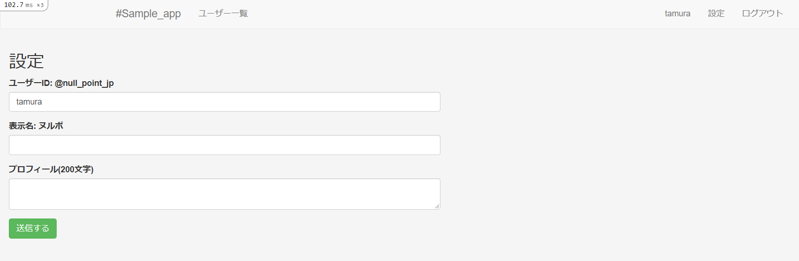

# 手順書

## 目次

- [手順書](#手順書)
  - [目次](#目次)
  - [twitter クローン作成](#twitter-クローン作成)
    - [使用 Gem のインストール](#使用-gem-のインストール)
    - [css のフォーマットを変更](#css-のフォーマットを変更)
    - [認証機能のコードを自動生成](#認証機能のコードを自動生成)
    - [scaffold で users を作成](#scaffold-で-users-を作成)
    - [ユーザー名、表示名、プロフィールのカラムを追加](#ユーザー名表示名プロフィールのカラムを追加)
    - [マイグレーションしてデータベース・テーブルを作成](#マイグレーションしてデータベーステーブルを作成)
    - [サインアップ用のコントローラーを生成](#サインアップ用のコントローラーを生成)
    - [Bootstrap の読み込み](#bootstrap-の読み込み)
    - [layout の変更](#layout-の変更)
    - [サインアップ機能(新規作成画面)の実装](#サインアップ機能新規作成画面の実装)
    - [サインアップ機能(新規登録の実行)の実装](#サインアップ機能新規登録の実行の実装)
    - [登録に失敗した際のエラーメッセージを表示](#登録に失敗した際のエラーメッセージを表示)
    - [デフォルトの言語を日本語に設定する](#デフォルトの言語を日本語に設定する)
    - [ロケールファイル追加](#ロケールファイル追加)
    - [背景画像の設定](#背景画像の設定)
    - [サインイン機能(ログイン画面)の実装](#サインイン機能ログイン画面の実装)
    - [ログイン画面へのリンク作成](#ログイン画面へのリンク作成)
    - [ログイン機能(ログイン処理)の実装](#ログイン機能ログイン処理の実装)
    - [ログイン失敗時のエラーメッセージ表示](#ログイン失敗時のエラーメッセージ表示)
    - [ユーザー一覧とプロフィール](#ユーザー一覧とプロフィール)
    - [Users#index の Template(View) を書く](#usersindex-の-templateview-を書く)
    - [Users#showのTemplate(View)を書く](#usersshowのtemplateviewを書く)
    - [Users#indexを調整する](#usersindexを調整する)
    - [Users#showを調整する](#usersshowを調整する)
    - [ヘッダーのPartial(View)の書く](#ヘッダーのpartialviewの書く)
    - [プロフィール設定](#プロフィール設定)
    - [helper を使う](#helper-を使う)
    - [Settings#edit を調整する](#settingsedit-を調整する)
    - [Settings#editのスタイル設定](#settingseditのスタイル設定)
    - [validation の設定](#validation-の設定)
    - [ログアウト機能](#ログアウト機能)
    - [[TODO] Users#index, showをログインしていないと入れないようにする](#todo-usersindex-showをログインしていないと入れないようにする)
    - [noticeの表示](#noticeの表示)
    - [Sessions#new の notice](#sessionsnew-の-notice)

## twitter クローン作成

### 使用 Gem のインストール

Gemfile に以下の欄を追加

| gem | 内容 |
| ---- | ---- |
| sorcery | 認証機能 |
| haml-rails | HTML 特化の文法を持つテンプレートエンジン |
| bootstrap-sass | CSS フレームワーク |

```Gemfile
gem 'sorcery'
gem 'haml-rails'
gem 'bootstrap-sass'
gem 'record_tag_helper'
```

インストールする

```bash
bundle install
```

### css のフォーマットを変更

railsデフォルトのscssではなくて、より簡潔な記述が出来るsassを使う

* config/application.rb

```rb
     # The default locale is :en and all translations from config/locales/*.rb,yml are auto loaded.
     # config.i18n.load_path += Dir[Rails.root.join('my', 'locales', '*.{rb,yml}').to_s]
     # config.i18n.default_locale = :de
 
     config.sass.preferred_syntax = :sass
   end
 end
```

### 認証機能のコードを自動生成

認証機能のためのコードを自動生成させる。

* gem の sorcery の機能を使う。

```bash
rails g sorcery:install
```

### scaffold で users を作成

* sorcery:install で users テーブル作成のマイグレーションファイルを作成している

  * --skip-migration する

* scaffold で通常生成される scaffold.css というファイルが bootstrap と競合して表示がおかしくなる

  * 不要

* -s : 既存のファイル生成をスキップする

* --skip-collision-check : Skip collision check

```bash
rails g scaffold user -s --no-stylesheets --skip-migration --skip-collision-check
```

### ユーザー名、表示名、プロフィールのカラムを追加

```bash
rails g migration add_name_and_screen_name_and_bio_to_users name:string screen_name:string bio:string
```

### マイグレーションしてデータベース・テーブルを作成

```bash
rake db:migrate
```

### サインアップ用のコントローラーを生成

サインアップの機能に、registrations の名前をあてている

新規登録フォーム画面の new アクションと、それを POST メソッドで受け取るcreate アクションを想定していますが、テンプレートを持つ画面は new 飲みなので、new のみ指定する。

```bash
rails generate controller registrations new
```

### Bootstrap の読み込み

app/assets/stylesheets/application.css を application.css.sass という名前に変更する

```bash
mv ./app/assets/stylesheets/application.css{,.sass}
```

ファイル内に bootstrap を import する

* app/assets/stylesheets/application.css.sass

```sass
 *= require_tree .
 *= require_self
 */

@import bootstrap
```

### layout の変更

* app/views/layouts/application.html.erb

バックアップを取る

```bash
cp ./app/views/layouts/application.html.erb{,.default}
```

application.html.erb を変更する

```erb
<!DOCTYPE html>
<html>
  <head>
    <title>SampleApp</title>
    <meta name="viewport" content="width=device-width,initial-scale=1">
    <%= csrf_meta_tags %>
    <%= csp_meta_tag %>

    <%= stylesheet_link_tag 'application', media: 'all', 'data-turbolinks-track': 'reload' %>
    <%= javascript_pack_tag 'application', 'data-turbolinks-track': 'reload' %>
  </head>

  <body id="application">
    <div>
      <%= yield %>
    </div>
  </body>
</html>
```

変更を見る

```bash
$ diff ./app/views/layouts/application.html.erb{.default,}
13,14c13,16
<   <body>
<     <%= yield %>
---
>   <body id="application">
>     <div>
>       <%= yield %>
>     </div>
```

http://localhost:3000/registrations/new へアクセス


### サインアップ機能(新規作成画面)の実装

* config/routes.rb

バックアップを取る

```bash
cp ./config/routes.rb{,.default}
```

Routing を実装する

```bash
$ diff ./config/routes.rb{.default,}
2,3c2
<   get 'registrations/new'
<   resources :users
---
>   resource :registrations, only: [:new, :create]
```

* app/models/user.rb

バックアップを取る

```bash
cp ./app/models/user.rb{,.default}
```

Model を実装する

* バリデーションは極力早く書くように

* 開発中であってもおかしいレコードが DB に入り込まないように意識することが重要

```bash
$ diff ./app/models/user.rb{.default,}
2a3,9
>
>   validates :name, presence: true, uniqueness: { case_sensitive: false }, format: { with: /\A[a-z][a-z0-9]+\z/ }, length: { in: 4..24 }
>   validates :screen_name, length: { maximum: 140 }
>   validates :bio, length: { maximum: 200  }
>   validates :email, presence: true, uniqueness: { case_sensitive: false }
>   validates :password, confirmation: true, length: { in: 6..24 }, if: :password
>   validates :password_confirmation, presence: true, if: :password
```

* app/controllers/registrations_controller.rb

バックアップを取る

```bash
cp ./app/controllers/registrations_controller.rb{,.default}
```

Controller を実装する

```rb
class RegistrationsController < ApplicationController
  def new
    @user = User.new
  end
end
```

比較する

```bash
$ diff ./app/controllers/registrations_controller.rb{.default,}
2a3
>     @user = User.new
```

* app/views/registrations/new.html.haml

バックアップを取る

```bash
cp ./app/views/registrations/new.html.haml{,.default}
```

View を実装する

```haml
%h1 Registrations#new
%p Find me in app/views/registrations/new.html.haml

= form_for @user, url: registrations_path, method: :post do |f|
  = f.label :name
  = f.text_field :name
  = f.label :email
  = f.text_field :email
  = f.label :password
  = f.password_field :password
  = f.label :password_confirmation
  = f.password_field :password_confirmation
  = f.submit
```

比較する

```bash
$ diff ./app/views/registrations/new.html.haml{.default,}
2a3,13
>
> = form_for @user, url: registrations_path, method: :post do |f|
>   = f.label :name
>   = f.text_field :name
>   = f.label :email
>   = f.text_field :email
>   = f.label :password
>   = f.password_field :password
>   = f.label :password_confirmation
>   = f.password_field :password_confirmation
>   = f.submit
\ No newline at end of file
```


### サインアップ機能(新規登録の実行)の実装

Routing 定義

サインアップ後に、トップページを表示するようにしたいので、root toで定義する

* とりあえずここではこのページで定義しておいて、Tweet機能ができてタイムラインができてからそれに置き換える

* config/routes.rb

```rb
Rails.application.routes.draw do
  resource :registrations, only: [:new, :create]
  root to: 'registrations#new'
  # For details on the DSL available within this file, see https://guides.rubyonrails.org/routing.html
end
```

Controller 定義

* app/controllers/registrations_controller.rb

```rb
class RegistrationsController < ApplicationController
  def new
    @user = User.new
  end

  def create
    @user = User.new(params_user)

    if @user.save
      redirect_to root_url
    else
      render :new
    end
  end

  private

  def params_user
    params.require(:user).permit(:name, :email, :password, :password_confirmation)
  end
end
```

### 登録に失敗した際のエラーメッセージを表示

* app/views/registrations/new.html.haml

```haml
%h1 Registrations#new
%p Find me in app/views/registrations/new.html.haml

- @user.errors.each do |attr, message|
  .alert.alert-danger= message

= form_for @user, url: registrations_path, method: :post do |f|
  = f.label :name
  = f.text_field :name
  = f.label :email
  = f.text_field :email
  = f.label :password
  = f.password_field :password
  = f.label :password_confirmation
  = f.password_field :password_confirmation
  = f.submit
```

### デフォルトの言語を日本語に設定する

* config/application.rb

```rb
require_relative "boot"

require "rails/all"

# Require the gems listed in Gemfile, including any gems
# you've limited to :test, :development, or :production.
Bundler.require(*Rails.groups)

module SampleApp
  class Application < Rails::Application
    # Initialize configuration defaults for originally generated Rails version.
    config.load_defaults 6.1

    # Configuration for the application, engines, and railties goes here.
    #
    # These settings can be overridden in specific environments using the files
    # in config/environments, which are processed later.
    #
    # config.time_zone = "Central Time (US & Canada)"
    # config.eager_load_paths << Rails.root.join("extras")
    config.i18n.default_locale = :ja
    
    config.sass.preferred_syntax = :sass
  end
end
```

### ロケールファイル追加

各言語ごとの文章を定義しておくファイルをロケールファイルと呼ぶ

config/locales/jp.yml を作成する

```bash
vi config/locales/jp.yml
```

* config/locales/jp.yml

```yml
ja:
  activerecord:
    errors:
      models:
```

メッセージを定義する

```yml
ja:
  activerecord:
    errors:
      models:
        user:
            attributes:
              name:
                blank: ユーザー名は空ではいけません
                taken: ユーザー名は既に利用されています
                invalid: ユーザー名には半角英数字のみ利用できます
                too_long: ユーザー名は24文字まで利用できます
                too_short: ユーザー名は最短で4文字必要です
              email:
                blank: メールアドレスが空です
                taken: メールアドレスが既に使用済みです
              password:
                blank: パスワードが空です
                too_long: パスワードは24文字以内で利用できます
                too_short: パスワードは6文字以上で利用できます
              password_confirmation:
                blank: 確認用パスワードが空です
                confirmation: 確認用パスワードが一致しません
              bio:
                too_long: プロフィールは200文字以内でなければなりません
```

### 背景画像の設定

* app/views/layouts/registrations.html.haml

ファイルを生成する

```bash
code app/views/layouts/registrations.html.haml
```

以下を追加する

```haml
!!!
%html
%head
  %title Sample_app
  = stylesheet_link_tag    'application', media: 'all', 'data-turbolinks-track' => true
  = javascript_pack_tag 'application', 'data-turbolinks-track' => true
  = csrf_meta_tags
%body#registrations
  = yield
```

* app/assets/stylesheets/application.css.sass

```sass
 *= require_tree .
 *= require_self
 */
@import bootstrap

 
html, body
  width: 100%
  height: 100%
 
.clear
  clear: both
```

背景画像を app/assets/images/back.jpg に配置する

```bash
cp ../img/Hosei.png app/assets/images/back.jpg
```

```bash
code app/assets/stylesheets/registrations.css.sass
```

* app/assets/stylesheets/registrations.css.sass

```sass
// Place all the styles related to the registrations controller here.
// They will automatically be included in application.css.
// You can use Sass (SCSS) here: http://sass-lang.com/
 
#registrations
  background-image: asset-url("back.jpg")
  background-position: center
  background-size: cover
  background-color: transparent
  background-repeat: no-repeat
  background-color: #050911
  #registrations-new
    width: 100%
    height: 100%
    .left-content
      margin-top: 45px
      padding: 0px 45px
      color: #fff
      h1
        font-size: 50px
        margin: 0px
        margin-top: 10px
      .ex
        font-size: 18px
        margin: 45px 0px
    .right-content
      padding: 0px 45px
      form
        margin: 45px 0px
        padding: 30px 35px
        border: 1px solid #fff
        border-radius: 6px
        background-color: rgba(0, 0, 0, 0.3)
        color: #fff
        h2
          margin: 0px 0px 20px 0px
          border-bottom: 1px solid rgba(255, 255, 255, 0.5)
          padding-bottom: 10px
          font-size: 20px
        .control-label
          font-weight: 400
        .btn
          width: 100%
          padding: 12px
          margin-top: 10px
          margin-bottom: 10px
          font-size: 16px
```

* app/views/registrations/new.html.haml

```haml
#registrations-new
  .col-xs-6.left-content
    %h1 #Sample_app
    %p.ex
      このサイトは、シラバスのRails学習コースの完成形サンプルアプリです。
    %p.by
      開発者: @null_point デザイン: @null_point 企画: @null_point
  .col-xs-6.right-content
    = form_for @user, url: registrations_path, method: :post do |f|
      %h2
        会員登録する
      - @user.errors.each do |attr, message|
        .alert.alert-danger= message
      .form-group
        = f.label :name, "ユーザーID: @@null_point_jp", class: "control-label"
        = f.text_field :name, class: "form-control"
      .form-group
        = f.label :email,"メールアドレス: hello@@null_point.jp", class: "control-label"
        = f.text_field :email, class: "form-control"
      .form-group
        = f.label :password, "パスワード: 6文字以上", class: "control-label"
        = f.password_field :password, class: "form-control"
      .form-group
        = f.label :password_confirmation, "確認用パスワード: 6文字以上", class: "control-label"
        = f.password_field :password_confirmation, class: "form-control"
      = f.submit "登録する", class: "btn btn-primary"
      .clear
```


### サインイン機能(ログイン画面)の実装

ログイン画面を new, その送信先のアクションを create, ログアウトを destroy という名前で実装する

コントローラー名は sessions という名前にする

```bash
rails g controller sessions new
```

Route 定義

```rb
Rails.application.routes.draw do
  resource :registrations, only: [:new, :create]
  resource :sessions, only: [:new, :create, :destroy]
  
  root to: 'registrations#new'
  # For details on the DSL available within this file, see https://guides.rubyonrails.org/routing.html
end
```

### ログイン画面へのリンク作成

* app/assets/stylesheets/registrations.css.sass

```sass
          margin-top: 10px
          margin-bottom: 10px
          font-size: 16px
        .login
          color: #fff
          text-decoration: underline
```

* app/views/registrations/new.html.haml

```haml
        = f.label :password, "パスワード: 6文字以上", class: "control-label"
        = f.password_field :password, class: "form-control"
      .form-group
        = f.label :password_confirmation, "確認用パスワード: 6文字以上", class: "control-label"
        = f.password_field :password_confirmation, class: "form-control"
      = f.submit "登録する", class: "btn btn-primary"
      = link_to "ログインする", new_sessions_path, class: "login pull-right"
      .clear
```

Controller (アクション)定義

* app/controllers/sessions_controller.rb

```rb
class SessionsController < ApplicationController
  def new
    @user = User.new
  end
end
```

View (テンプレート)実装

* app/views/sessions/new.html.haml

```haml
%h1 Sessions#new
%p Find me in app/views/sessions/new.html.haml

= form_for @user, url: sessions_path, method: :post do |f|
  = f.label :email
  = f.text_field :email
  = f.label :password
  = f.password_field :password
  = f.submit
```


### ログイン機能(ログイン処理)の実装

* app/controllers/sessions_controller.rb

```rb
class SessionsController < ApplicationController
  def new
    @user = User.new
  end

  def create
    email    = params_user[:email]
    password = params_user[:password]

    if login(email, password)
      redirect_to root_url, notice: "successfully logged in."
    else
      @user = User.new(email: email)
      render :new
    end
  end

  private

  def params_user
    params.require(:user).permit(:email, :password)
  end
end
```

### ログイン失敗時のエラーメッセージ表示

* app/views/sessions/new.html.haml

```haml
%h1 Sessions#new
%p Find me in app/views/sessions/new.html.haml

- if action_name == "create"
  .alert.alert-danger
    メールアドレスまたはパスワードが正しくありません。

= form_for @user, url: sessions_path, method: :post do |f|
  = f.label :email
  = f.text_field :email
  = f.label :password
  = f.password_field :password
  = f.submit
```

View (レイアウト)定義

* app/views/layouts/sessions.html.haml

```haml
!!!
%html
%head
  %title Sample_appSession
  = stylesheet_link_tag    'application', media: 'all', 'data-turbolinks-track' => true
  = javascript_include_tag 'application', 'data-turbolinks-track' => true
  = csrf_meta_tags
%body#sessions
  = yield
```

* app/assets/stylesheets/sessions.css.sass

```sass
// Place all the styles related to the sessions controller here.
// They will automatically be included in application.css.
// You can use Sass here: https://sass-lang.com/

#sessions
  display: table
  widows: 100%
  height: 100%
  background-color: #f5f5f5
  #sessions-new
    display: table-cell
    vertical-align: middle
    .login-content
      margin: 0 auto
      float: none
      form
        border: 1px solid #ddd
        border-bottom-width: 3px
        border-radius: 6px
        background-color: #fff
        h2
          margin: 0px
          padding: 12px
          text-align: center
          border-bottom: 2px solid #ddd
          font-size: 18px
          font-weight: 600
        .form-body
          padding: 25px 30px
          .control-label
            font-weight: 400
          .btn
            width: 100%
            margin: 10px 0px
          .signup
            text-decoration: underline
```

* app/views/sessions/new.html.haml

```haml
#sessions-new
  .col-xs-5.login-content
    - if action_name == "create"
      .alert.alert-danger
        メールアドレスまたはパスワードが正しくありません。
    = form_for @user, url: sessions_path, method: :post do |f|
      %h2
        ログイン
      .form-body
        .form-group
          = f.label :email,"メールアドレス：hello@null_point.jp", class: "control-label"
          = f.text_field :email, class: "form-control"
        .form-group
          = f.label :password, "パスワード：6文字以上", class: "control-label"
          = f.password_field :password, class: "form-control"
        = f.submit "ログイン", class: "btn btn-success"
        = link_to root_path, class: "pull-right signup" do
          会員登録する
        .clear
```


### ユーザー一覧とプロフィール

scaffold コマンドなので Model, View, Controller をそれぞれ自動で生成する

* サインアップ・サインイン機能を作るときにユーザーを表す Model はすでに作成されており、勝手に上書きされては困る

```bash
rails g scaffold user -s --no-stylesheets --skip-migration --skip-collision-check
```

Routing 定義

* config/routes.rb

```rb
resource :registrations, only: [:new, :create]
resource :sessions, only: [:new, :create, :destroy]
resources :users, only: [:index, :show]
```

Controller (アクション)定義

* app/controllers/users_controller.rb

```rb
class UsersController < ApplicationController
  #before_action :set_user, only: %i[ show edit update destroy ]

  # GET /users or /users.json
  def index
    @users = User.all
  end

  # GET /users/1 or /users/1.json
  def show
    @user = User.find(params[:id])
  end

  # GET /users/new
  def new
    @user = User.new
  end

  # GET /users/1/edit
  def edit
  end

  # POST /users or /users.json
  def create
    @user = User.new(user_params)

    respond_to do |format|
      if @user.save
        format.html { redirect_to @user, notice: "User was successfully created." }
        format.json { render :show, status: :created, location: @user }
      else
        format.html { render :new, status: :unprocessable_entity }
        format.json { render json: @user.errors, status: :unprocessable_entity }
      end
    end
  end

  # PATCH/PUT /users/1 or /users/1.json
  def update
    respond_to do |format|
      if @user.update(user_params)
        format.html { redirect_to @user, notice: "User was successfully updated." }
        format.json { render :show, status: :ok, location: @user }
      else
        format.html { render :edit, status: :unprocessable_entity }
        format.json { render json: @user.errors, status: :unprocessable_entity }
      end
    end
  end

  # DELETE /users/1 or /users/1.json
  def destroy
    @user.destroy
    respond_to do |format|
      format.html { redirect_to users_url, notice: "User was successfully destroyed." }
      format.json { head :no_content }
    end
  end

  private
    # Use callbacks to share common setup or constraints between actions.
    def set_user
      @user = User.find(params[:id])
    end

    # Only allow a list of trusted parameters through.
    def user_params
      params.fetch(:user, {})
    end
end
```

### Users#index の Template(View) を書く

* app/views/users/index.html.haml

```haml
%h1 Listing users

%table
  %tr
    %th

  - @users.each do |user|
    %tr
      %td= link_to user.name, user
```


### Users#showのTemplate(View)を書く

* app/views/users/show.html.haml

```haml
%p#notice= notice

= link_to 'Back', users_path
```

### Users#indexを調整する

* app/assets/stylesheets/application.css.sass

```sass
@import bootstrap

 
html, body
  width: 100%
  height: 100%
 
.clear
  clear: both

#users-content
  float: none
  margin: 0 auto 35px
  padding: 0px
  background-color: #fff
  border: 1px solid #ddd
  border-radius: 6px
  border-bottom-width: 3px
  .list-group
    margin-bottom: -1px
    .list-group-item
      border: none
      border-bottom: 1px solid #ddd
      margin-bottom: 0px
      &:last-child
      .user
        .user-name
          a
            color: #555
        .user-id
          font-size: 14px
          color: #aaa
          font-weight: 400
        .time
          font-size: 12px
          color: #aaa
          font-weight: 400
    .user-list
      border-bottom-width: 2px
      h2
        font-size: 20px
        margin: 0px
```

* app/views/users/index.html.haml

```haml
.col-xs-8#users-content
  .list-group
    .list-group-item.user-list
      %h2 ユーザー一覧
    = div_for @users, class: "list-group-item" do |u|
      %h4.user
        %span.user-name
          = link_to u.name, user_path(u)
        %span.user-id
          @#{u.name}
      .bio
        = u.bio
```


### Users#showを調整する

* app/views/users/show.html.haml

```haml
.col-xs-8#users-content
  .user-info
    %span.user-name
      = @user.name
    %span.user-id
      @#{@user.name}
    .bio
      = @user.bio
```

* app/assets/stylesheets/application.css.sass

```sass
@import bootstrap

html, body
  width: 100%
  height: 100%

#application
  background-color: #f5f5f5

.clear
  clear: both

#users-content
  float: none
  margin: 0 auto 35px
  padding: 0px
  background-color: #fff
  border: 1px solid #ddd
  border-radius: 6px
  border-bottom-width: 3px
  .list-group
    margin-bottom: -1px
    .list-group-item
      border: none
      border-bottom: 1px solid #ddd
      margin-bottom: 0px
      &:last-child
      .user
        .user-name
          a
            color: #555
        .user-id
          font-size: 14px
          color: #aaa
          font-weight: 400
        .time
          font-size: 12px
          color: #aaa
          font-weight: 400
    .user-list
      border-bottom-width: 2px
      h2
        font-size: 20px
        margin: 0px
  .user-info
    padding: 20px 35px
    .user-name
      font-size: 28px
      font-weight: 600
    .user-id
      font-size: 18px
      color: #aaa
    .bio
      margin-top: 5px
  .nav.nav-tabs
    border-top: 1px solid #ddd
    border-bottom: 2px solid #ddd
    li
      a
        border: none
        &:hover
          background-color: #fff
        .text
        .num
          font-size: 28px
```


### ヘッダーのPartial(View)の書く

* app/views/layouts/_header.html.haml

```haml
.navbar.navbar-default
  .container
    .navbar-header
      = link_to '#Sample_app', root_url, class: "navbar-brand"
    - if logged_in?
      %ul.nav.navbar-nav
        %li= link_to "ユーザー一覧", users_path
      %ul.nav.navbar-nav.navbar-right
        %li= link_to current_user.name, current_user
        %li= link_to "ログアウト", sessions_path, method: :delete
    - else
      %ul.nav.navbar-nav.navbar-right
        %li= link_to "会員登録", new_registrations_path
        %li= link_to "ログイン", new_sessions_path
```

* app/views/layouts/application.html.erb

```erb
<!DOCTYPE html>
<html>
  <head>
    <title>Sample_app</title>
    <meta name="viewport" content="width=device-width,initial-scale=1">
    <%= csrf_meta_tags %>
    <%= csp_meta_tag %>

    <%= stylesheet_link_tag 'application', media: 'all', 'data-turbolinks-track': 'reload' %>
    <%= javascript_pack_tag 'application', 'data-turbolinks-track': 'reload' %>
  </head>

  <body id="application">
    <div>
      <%= render partial: "layouts/header" %>
      <%= yield %>
    </div>
  </body>
</html>
```


### プロフィール設定

```bash
rails g controller settings edit
```

Routing を定義する

* config/routes.rb

```rb
Rails.application.routes.draw do
  resource :registrations, only: [:new, :create]
  resource :sessions, only: [:new, :create, :destroy]
  resource :settings, only: [:edit, :update]
  resources :users, only: [:index, :show]
  
  root to: 'registrations#new'
  # For details on the DSL available within this file, see https://guides.rubyonrails.org/routing.html
end
```

Controller を定義する

* app/controllers/settings_controller.rb

```rb
class SettingsController < ApplicationController
  def edit
    @user = current_user
  end

   
  def update
    @user = current_user
    @user.update_attributes(params_user)
    redirect_to user_url(@user)
  end

  private

  def params_user
    params.require(:user).permit(:name, :screen_name, :bio)
  end
end
```

* View を定義する

```haml
%h1 Settings#edit
%p Find me in app/views/settings/edit.html.haml

= form_for @user, url: settings_path, method: :put do |f|
  = f.label :name
  = f.text_field :name
  = f.label :screen_name
  = f.text_field :screen_name
  = f.label :bio
  = f.text_area :bio
  = f.submit
```

* app/views/layouts/_header.html.haml

```haml
.navbar.navbar-default
  .container
    .navbar-header
      = link_to '#Sample_app', root_url, class: "navbar-brand"
    - if logged_in?
      %ul.nav.navbar-nav
        %li= link_to "ユーザー一覧", users_path
      %ul.nav.navbar-nav.navbar-right
        %li= link_to current_user.name, current_user
        %li= link_to "設定", edit_settings_path
        %li= link_to "ログアウト", sessions_path, method: :delete
    - else
      %ul.nav.navbar-nav.navbar-right
        %li= link_to "会員登録", new_registrations_path
        %li= link_to "ログイン", new_sessions_path
```


### helper を使う

```rb
module UsersHelper
    def render_user_screen_name user
        if user.screen_name.blank?
            user.name
        else
            user.screen_name
        end
    end
end
```

* app/views/users/index.html.haml

```haml
.col-xs-8#users-content
  .list-group
    .list-group-item.user-list
      %h2 ユーザー一覧
    = div_for @users, class: "list-group-item" do |u|
      %h4.user
        %span.user-name
          = link_to u.name, user_path(u)
          = link_to render_user_screen_name(u), user_path(u)
        %span.user-id
          @#{u.name}
      .bio
        = u.bio
```

* app/views/users/show.html.haml

```haml
.col-xs-8#users-content
  .user-info
    %span.user-name
      = @user.name
      = render_user_screen_name(@user)
    %span.user-id
      @#{@user.name}
    .bio
      = @user.bio
```

### Settings#edit を調整する

* app/views/settings/edit.html.haml

```haml
#settings-edit
  .col-xs-6.settings-content
    = form_for @user, url: settings_path, method: :put do |f|
      %h2
        設定
      .form-body
        .form-group
          = f.label :name, "ユーザーID: @null_point_jp", class: "control-label"
          = f.text_field :name, class: "form-control"
        .form-group
          = f.label :screen_name, "表示名: ヌルポ", class: "control-label"
          = f.text_field :screen_name, class: "form-control"
        .form-group
          = f.label :bio, "プロフィール(200文字)", class: "control-label"
          = f.text_area :bio, class: "form-control"
        = f.submit "送信する", class: "btn btn-success"
```



### Settings#editのスタイル設定

* app/assets/stylesheets/settings.css.sass

```sass
// Place all the styles related to the settings controller here.
// They will automatically be included in application.css.
// You can use Sass here: https://sass-lang.com/

#settings-edit
  .settings-content
    float: none
    margin: 0 auto 35px
    form
      border: 1px solid #ddd
      border-bottom-width: 3px
      border-radius: 6px
      background-color: #fff
      h2
        margin: 0px
        padding: 12px
        text-align: center
        border-bottom: 2px solid #ddd
        font-size: 18px
        font-weight: 600
      .form-body
        padding: 25px 30px
        .control-label
          font-weight: 400
        textarea
          height: 100px
        .btn
          width: 100%
          margin: 10px 0px
```


### validation の設定

* app/controllers/settings_controller.rb

```rb
class SettingsController < ApplicationController
  def edit
    @user = current_user
  end

   
  def update
    @user = current_user
    if @user.update(params_user)
      redirect_to user_url(@user)
    else
      render :edit
    end
  end

  private

  def params_user
    params.require(:user).permit(:name, :screen_name, :bio)
  end
end
```

* app/views/settings/edit.html.haml

```haml
#settings-edit
  .col-xs-6.settings-content
    - @user.errors.each do |attr, message|
      .alert.alert-danger= message
    = form_for @user, url: settings_path, method: :put do |f|
      %h2
        設定
      .form-body
        .form-group
          = f.label :name, "ユーザーID: @null_point_jp", class: "control-label"
          = f.text_field :name, class: "form-control"
        .form-group
          = f.label :screen_name, "表示名: ヌルポ", class: "control-label"
          = f.text_field :screen_name, class: "form-control"
        .form-group
          = f.label :bio, "プロフィール(200文字)", class: "control-label"
          = f.text_area :bio, class: "form-control"
        = f.submit "送信する", class: "btn btn-success"
```

### ログアウト機能

* app/controllers/sessions_controller.rb

```rb
class SessionsController < ApplicationController
  def new
    @user = User.new
  end

  def create
    email    = params_user[:email]
    password = params_user[:password]

    if login(email, password)
      redirect_to root_url, notice: "successfully logged in."
    else
      @user = User.new(email: email)
      render :new
    end
  end

  def destroy
    logout
    redirect_to root_url
  end

  private

  def params_user
    params.require(:user).permit(:email, :password)
  end
end
```

### [TODO] Users#index, showをログインしていないと入れないようにする

* app/controllers/users_controller.rb

```rb
class UsersController < ApplicationController
  #before_action :set_user, only: %i[ show edit update destroy ]
  before_filter :require_login
  # GET /users or /users.json
  def index
    @users = User.all
  end

  # GET /users/1 or /users/1.json
  def show
    @user = User.find(params[:id])
  end
end
```

### noticeの表示

Settings#edit の notice

* app/controllers/settings_controller.rb

```rb
class SettingsController < ApplicationController
  def edit
    @user = current_user
  end

   
  def update
    @user = current_user
    if @user.update(params_user)
      redirect_to user_url(@user), notice: "プロフィールを更新しました"
    else
      render :edit
    end
  end

  private

  def params_user
    params.require(:user).permit(:name, :screen_name, :bio)
  end
end
```

* app/views/users/show.html.haml

```haml
.col-xs-8#users-content
  .user-info
    - if notice
      .alert.alert-info= notice
    %span.user-name
      = @user.name
      = render_user_screen_name(@user)
    %span.user-id
      @#{@user.name}
    .bio
      = @user.bio
```

### Sessions#new の notice

* app/controllers/sessions_controller.rb

```rb
class SessionsController < ApplicationController
  def new
    @user = User.new
  end

  def create
    email    = params_user[:email]
    password = params_user[:password]

    if login(email, password)
      redirect_to root_url, notice: "サインインしました"
    else
      @user = User.new(email: email)
      render :new
    end
  end

  def destroy
    logout
    redirect_to root_url, notice: "サインアウトしました"
  end

  private

  def params_user
    params.require(:user).permit(:email, :password)
  end
end
```

* app/views/registrations/new.html.haml

```haml
#registrations-new
  .col-xs-6.left-content
    %h1 #Sample_app
    %p.ex
      このサイトは、シラバスのRails学習コースの完成形サンプルアプリです。
    %p.by
      開発者: @null_point デザイン: @null_point 企画: @null_point
    - if notice
       %p
         .alert.alert-info= notice
  .col-xs-6.right-content
    = form_for @user, url: registrations_path, method: :post do |f|
      %h2
        会員登録する
      - @user.errors.each do |attr, message|
        .alert.alert-danger= message
      .form-group
        = f.label :name, "ユーザーID: @@null_point_jp", class: "control-label"
        = f.text_field :name, class: "form-control"
      .form-group
        = f.label :email,"メールアドレス: hello@@null_point.jp", class: "control-label"
        = f.text_field :email, class: "form-control"
      .form-group
        = f.label :password, "パスワード: 6文字以上", class: "control-label"
        = f.password_field :password, class: "form-control"
      .form-group
        = f.label :password_confirmation, "確認用パスワード: 6文字以上", class: "control-label"
        = f.password_field :password_confirmation, class: "form-control"
      = f.submit "登録する", class: "btn btn-primary"
      = link_to "ログインする", new_sessions_path, class: "login pull-right"
      .clear
```